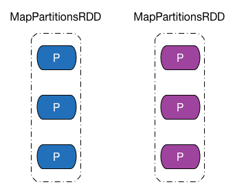

# 分区
RDD 内部的数据集合在逻辑上和物理上被划分成多个小子集合，这样的每一个子集合我们将其称为分区，分区的个数会决定并行计算的粒度，而每一个分区数值的计算都是在一个单独的任务中进行，因此并行任务的个数，也是由 RDD（实际上是一个阶段的末 RDD，调度章节会介绍）分区的个数决定的，后面具体说明分区与并行计算的关系。

在后文中，下图所示图形来表示 RDD 以及 RDD 内部的分区，RDD 上方文字表示该 RDD 的类型或者名字，分区颜色为紫红色表示该 RDD 内数据被缓存到存储介质中，蓝色表示该 RDD 为普通 RDD。



## 分区实现
分区的源码实现为 Partition 类。
```
/**
 * An identifier for a partition in an RDD.
 */
trait Partition extends Serializable {
  /**
   * Get the partition's index within its parent RDD
   */
  def index: Int

  // A better default implementation of HashCode
  override def hashCode(): Int = index
}
```

**RDD 只是数据集的抽象，分区内部并不会存储具体的数据。** Partition 类内包含一个 index 成员，表示该分区在 RDD 内的编号，通过 RDD 编号 + 分区编号可以唯一确定该分区对应的块编号，利用底层数据存储层提供的接口，就能从存储介质（如：HDFS、Memory）中提取出分区对应的数据。

RDD 抽象类中定义了 _partitions 数组成员和 partitions 方法，partitions 方法提供给外部开发者调用，用于获取 RDD 的所有分区。partitions 方法会调用内部 getPartitions 接口，RDD 的子类需要自行实现 getPartitions 接口。
```
@transient private var partitions_ : Array[Partition] = null

  /**
   * Implemented by subclasses to return the set of partitions in this RDD. This method will only
   * be called once, so it is safe to implement a time-consuming computation in it.
   */
  protected def getPartitions: Array[Partition]

  /**
   * Get the array of partitions of this RDD, taking into account whether the
   * RDD is checkpointed or not.
   */
  final def partitions: Array[Partition] = {
    checkpointRDD.map(_.partitions).getOrElse {
      if (partitions_ == null) {
        partitions_ = getPartitions
      }
      partitions_
    }
  }
```

## 分区个数
RDD 分区的一个分配原则是：尽可能使得分区的个数，等于集群核心数目。
RDD 可以通过创建操作或者转换操作得到。转换操作中，分区的个数会根据转换操作对应多个 RDD 之间的依赖关系确定，窄依赖子 RDD 由父 RDD 分区个数决定，Shuffle 依赖由子 RDD 分区器决定。

### parallelize方法
无论是以本地模式、Standalone 模式、Yarn 模式或者是 Mesos 模式来运行 Apache Spark，分区的默认个数等于对 spark.default.parallelism 的指定值，若该值未设置，则 Apache Spark 会根据不同集群模式的特征，来确定这个值。

### textFile方法
默认分区个数等于 min(defaultParallelism, 2)（见 SparkContext 类），而 defaultParallelism 实际上就是 parallelism 方法的默认分区值。

## 分区器
### 作用
1. 决定 Shuffle 过程中 Reducer 的个数（实际上是子 RDD 的分区个数）以及 Map 端的一条数据记录应该分配给哪一个 Reducer。这个应该是最主要的作用。
2. 决定 RDD 的分区数量。例如执行操作 groupByKey(new HashPartitioner(2)) 所生成的 ShuffledRDD 中，分区的数目等于 2。
3. 决定 CoGroupedRDD 与父 RDD 之间的依赖关系。这个在依赖小节说过。

Apache Spark 内置了两种分区器，分别是哈希分区器（Hash Partitioner）和范围分区器（Range Partitioner）

分区器对应的源码实现是 Partitioner 抽象类，Partitioner 的子类（包括自定义分区器）需要实现自己的 getPartition 函数，用于确定对于某一特定键值的键值对记录，会被分配到子RDD中的哪一个分区。
```
/**
 * An object that defines how the elements in a key-value pair RDD are partitioned by key.
 * Maps each key to a partition ID, from 0 to `numPartitions - 1`.
 */
abstract class Partitioner extends Serializable {
  def numPartitions: Int
  def getPartition(key: Any): Int
}
```

#### 哈希分区器

```
/**
 * A [[org.apache.spark.Partitioner]] that implements hash-based partitioning using
 * Java's `Object.hashCode`.
 *
 * Java arrays have hashCodes that are based on the arrays' identities rather than their contents,
 * so attempting to partition an RDD[Array[_]] or RDD[(Array[_], _)] using a HashPartitioner will
 * produce an unexpected or incorrect result.
 */
class HashPartitioner(partitions: Int) extends Partitioner {
  def numPartitions: Int = partitions

  def getPartition(key: Any): Int = key match {
    case null => 0
    case _ => Utils.nonNegativeMod(key.hashCode, numPartitions)
  }

  override def equals(other: Any): Boolean = other match {
    case h: HashPartitioner =>
      h.numPartitions == numPartitions
    case _ =>
      false
  }

  override def hashCode: Int = numPartitions
}
```


此例中整数的 hashCode 即其本身。

#### 范围分区器
哈希分析器的实现简单，运行速度快，但其本身有一明显的缺点：由于不关心键值的分布情况，其散列到不同分区的概率会因数据而异，个别情况下会导致一部分分区分配得到的数据多，一部分则比较少。范围分区器则在一定程度上避免这个问题，范围分区器争取将 **所有的分区尽可能分配得到相同多的数据，并且所有分区内数据的上界是有序的** 。


范围分区器需要做的事情有两个：
1. 根据父 RDD 的数据特征，确定子 RDD 分区的边界。
2. 给定一个键值对数据，能够快速根据键值定位其所应该被分配的分区编号。

**思路：** 对父 RDD 的数据进行采样（Sampling），将采样得到的数据排序，并分成 M 个数据块，分割点的键值作为后面快速定位的依据。

##### 老版分区器方法
```
//样本总量由子 RDD 的分区个数决定
val maxSampleSize = partitions * 20.0

//每个分区抽取特定比例的数据，采样比例 frac 等于采样数据大小 maxSampleSize 除以父 RDD 中的数据总量 rddSize
val rddSize = rdd.count() //便利一遍rdd
val frac = math.min(maxSampleSize / math.max(rddSize, 1), 1.0)

//使用的是 sample 转换操作进行数据的采样工作，采样完毕后对结果按照键值进行排序。
val rddSample = rdd.sample(false, frac, 1).map(_._1).collect().sorted //便利一遍rdd
if (rddSample.length == 0) {
  Array()

//确定边界的算法很简单，最后可以得到 partitions - 1 个边界。
val bounds = new Array[K](partitions - 1)
for (i <- 0 until partitions - 1) {
  val index = (rddSample.length - 1) * (i + 1) / partitions
  bounds(i) = rddSample(index)
}
bounds
```

[返回目录](../CONTENTS.md)