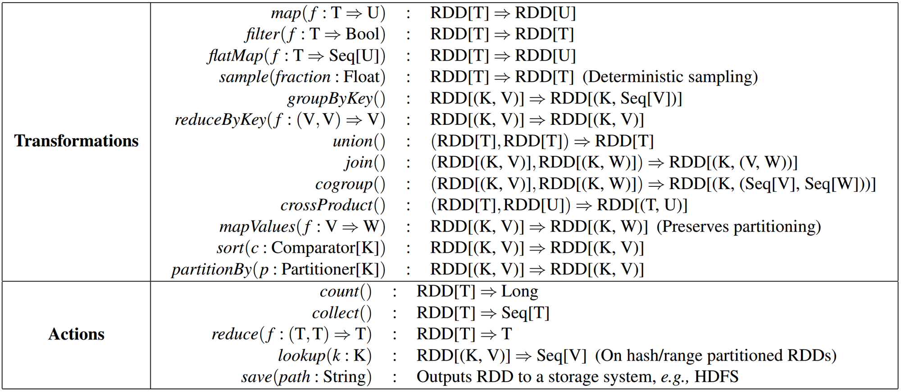
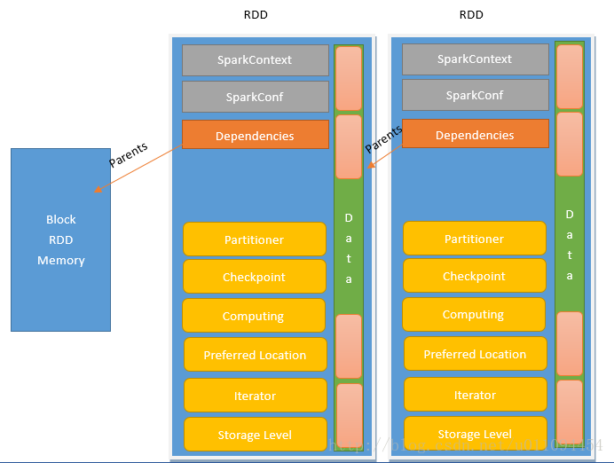
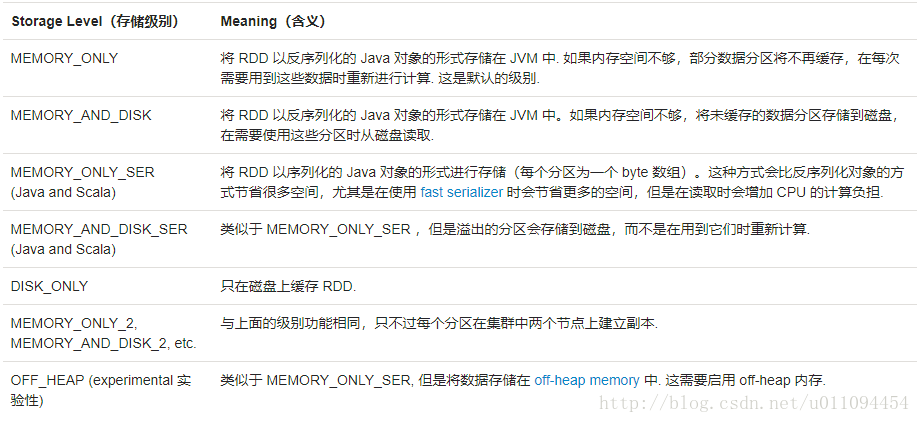

# 弹性分布式数据集（RDD）
## 特点
1. 是一个分区的*只读*记录的集合
2. 一个具有容错机制的特殊集
3. 只能通过在*稳定的存储器或其他RDD上的确定性操作*（转换）来创建
4. 可以分布在集群的节点上，以函数式操作集合的方式，进行各种并行操作

## partition & block
### block是HDFS上的概念
HDFS 中的 block 是分布式存储的最小单元，类似于盛放文件的盒子，一个文件可能要占多个盒子，但一个盒子里的内容只可能来自同一份文件。
>假设block设置为128M，你的文件是250M，那么这份文件占3个block（128+128+2）。这样的设计虽然会有一部分磁盘空间的浪费，但是整齐的block大小，便于快速找到、读取对应的内容。（p.s. 考虑到HDFS冗余设计，默认三份拷贝，实际上3*3=9个block的物理空间。）
### partition是RDD的最小单元
spark中的partition是RDD的最小单元，RDD是由分布在各个节点上的 partition 组成的。partition 是指的spark在计算过程中，生成的数据在计算空间内最小单元，同一份数据（RDD）的 partition 大小不一，数量不定，是根据application里的算子和最初读入的数据分块数量决定的，这也是为什么叫“弹性分布式”数据集的原因之一。

**总结：**

| |block|partition|
|----|:----:|:----:|
|概念空间|存储空间|计算空间|
|大小|固定|不固定|
|冗余|有，不易丢失|无，容易丢失|
|容错|3备份|重新计算|

## 算子
### 转换（transformation）
从现有的数据集创建一个新的数据集，惰性的，并不会直接计算结果。相反的，它们只是记住应用到基础数据集（例如一个文件）上的这些转换动作。只有当发生一个要求返回结果给Driver的动作（action）时，这些转换才会真正运行。

**注：** 默认情况下，每一个转换过的RDD都会在你在它之上执行一个动作时被重新计算。
### 动作（action）
在数据集上运行计算后，返回一个值给驱动程序。

## 结构

### Sparkcontext
SparkContext为Spark job的入口，由Spark driver创建在client端，包括集群连接，RddID，创建抽样，累加器，广播变量等信息。

### sparkconf
配置信息，即sc.conf，Spark参数配置信息，提供三个位置用来配置系统：
- Spark api：控制大部分的应用程序参数，可以用parkConf对象或者Java系统属性设置 
- 环境变量：可以通过每个节点的conf/spark-env.sh脚本设置。例如IP地址、端口等信息 
- 日志配置：可以通过log4j.properties配置

### Dependencies
详情请见[Spark依赖](./dependency.md)

### Partitioner
Partitioner决定RDD的分区方式。 
- Key-Value类型数据：
    1. HashPartitioner：Hash是以key作为分区条件的散列分布，分区数据不连续，极端情况也可能散列到少数几个分区上，导致数据不均等
    2. RangePartitioner：Range按Key的排序平衡分布，分区内数据连续，大小也相对均等。
- 非Key-Value类型：分区为None。

详情请见[Spark分区](./partitioner.md)

### Checkpoint
Checkpoint是Spark提供的一种缓存机制，当需要计算的RDD过多时，为了避免重新计算之前的RDD，可以对RDD做Checkpoint处理，检查RDD是否被物化或计算，并将结果持久化到磁盘或HDFS。(容错的一种优化) 
1. Checkpoint会把当前RDD保存到一个目录中。 
2. Checkpoint的时候，会把所有依赖的父级rdd信息清除掉。 
3. Checkpoint不会马上执行，要触发action操作的时候才会执行。 
4. 因为 Checkpoint会清除父级RDD的信息，所以在Checkpoint应该先做persist（持久化）操作，否则就要重新计算一遍。 
5. 一般来说，Lineage链较长、宽依赖的RDD需要采用检查点机制。 
6. Checkpoint的好处显而易见，比如做1000次迭代，在第999次时做了Checkpoint，如果第1000次的时候，只要重新计算第1000即可，不用从头到尾再计算一次。 
7. 与Spark提供的另一种缓存机制cache相比，cache 缓存数据由executor管理，当executor消失了，被cache的数据将被清除，RDD重新计算，而checkpoint将数据保存到磁盘或HDFS，job可以从checkpoint点继续计算。

### Iterator & Compute
都是来表示该RDD如何通过父RDD计算得到。

Iterator用来查找当前RDD Partition与父RDD中Partition的血缘关系。过程如下：
1. 若标记了有缓存，则取缓存，取不到则进行“计算或读检查点”（computeOrReadCheckpoint）。完了再存入缓存，以备后续使用。 
2. 若未标记有缓存，则直接进行“计算或读检查点”。 
3. “计算或读检查点”这个过程也做两个判断：有做过checkpoint，没有做过checkpoint。做过checkpoint则可以读取到检查点数据返回。无则调该rdd的实现类的computer函数计算。computer函数实现方式就是向上递归“获取父rdd分区数据进行计算”，直到遇到检查点rdd获取有缓存的rdd。

### PreferredLocation
它是一个列表，用于存储每个Partition的优先位置的一个列表。对于每个HDFS文件来说，这个列表保存的是每个Partition所在的块的位置，也就是对这个文件的“划分点”。

### StorageLevel
用来记录RDD的存储级别

[返回目录](../CONTENTS.md)