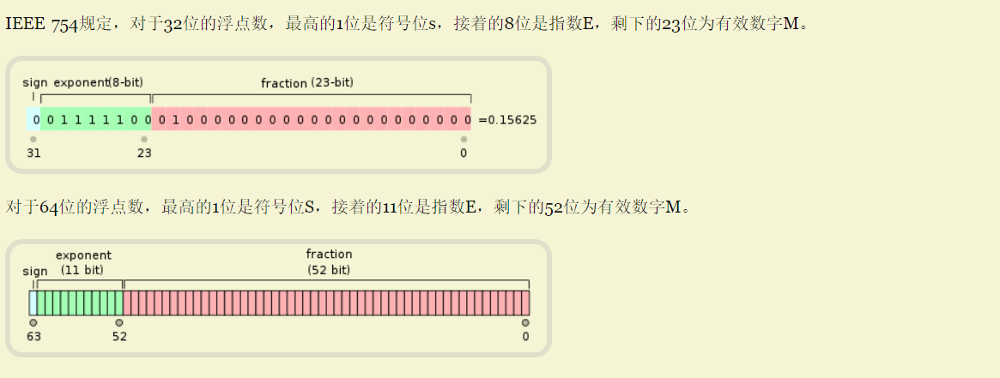

# 基本类型

## 整数类型
整数类型根据存储数据大小可以分为长整型（long）与短整型（short），根据是否存储负数分为有符号型（signed）与无符号型（unsigned），故整数类型共有6种：
- short (int)
- unsigned short (int)
- int
- unsigned int
- long (int)
- unsigned long (int)

根据机器不同，取值范围也不同，以下是详细对比：
16位机
|      类型      |    最大     |    最小    | 大小（字节） |
| :------------: | :---------: | :--------: | :----------: |
|     short      |   -32768    |   32767    |      2       |
| unsigned short |      0      |   65535    |      2       |
|      int       |   -32768    |   32767    |      2       |
|  unsigned int  |      0      |   65535    |      2       |
|      long      | -2147483648 | 2147483647 |      4       |
| unsigned long  |      0      | 4294967295 |      4       |

32位机
|      类型      |    最大     |    最小    | 大小（字节） |
| :------------: | :---------: | :--------: | :----------: |
|     short      |   -32768    |   32767    |      2       |
| unsigned short |      0      |   65535    |      2       |
|      int       | -2147483648 | 2147483647 |      4       |
|  unsigned int  |      0      | 4294967295 |      4       |
|      long      | -2147483648 | 2147483647 |      4       |
| unsigned long  |      0      | 4294967295 |      4       |

64位机
|      类型      |         最大         |         最小         | 大小（字节） |
| :------------: | :------------------: | :------------------: | :----------: |
|     short      |        -32768        |        32767         |      2       |
| unsigned short |          0           |        65535         |      2       |
|      int       |     -2147483648      |      2147483647      |      4       |
|  unsigned int  |          0           |      4294967295      |      4       |
|      long      | -9223372036854775808 | 9223372036854775807  |      8       |
| unsigned long  |          0           | 18446744073709551615 |      8       |

有符号型整数在计算机中均已补码的形式存储，其中最高位表示符号位，正数的补码为其源码，负数的补码形式为原码取反加一。对于1字节存储上看，0 ~ 127表示为0000 0000 ~ 0111 1111，-1 ~ -128表示为1111 1111 ~ 1000 0000。

### 整数常量
- 十进制：不已0开头的包含0~9的数字。
- 八进制：必须已0开头的包含0~7的数字。
- 十六进制：必须已0x开头的包含0~9的数字与a~f的字母。

## 浮点类型
包含三类：
- float：单精度浮点数
- double：双精度浮点数
- long double：扩展双精度浮点数

### 浮点数存储方式

对于IEEE标准下的浮点数格式：单精度（32位，精度为6个数字）、双精度（64位，精度为15个数字），用二进制科学计数法进行存储，每个数均由三部分组成：
- 符号（Sign）
- 指数（Exponent）
- 小数（Fraction）



二进制科学计数法可以表示为：

$$ V = (-1)^S * F * 2^E $$

举例来说，十进制的5.0，写成二进制是101.0，相当于$1.01×2^2$

对于二进制，小数（F）部分一定以1开头，故将其省略；指数部分使用无符号数（unsigned）表示，故存储时，对其加上中间值（单精度是127、双精度是1023）

指数E还可以再分成三种情况：
- E不全为0或不全为1。这时，浮点数就采用上面的规则表示，即指数E的计算值减去127（或1023），得到真实值，再将有效数字F前加上第一位的1。
- E全为0。这时，浮点数的指数E等于1-127（或者1-1023），有效数字F不再加上第一位的1，而是还原为0.xxxxxx的小数。这样做是为了表示±0，以及接近于0的很小的数字。
- E全为1。这时，如果有效数字M全为0，表示±无穷大（正负取决于符号位s）；如果有效数字M不全为0，表示这个数不是一个数（NaN）。

## 字符类型
字符类型占用1字节，C语言把字符当做小整形处理，故可以对字符进行加减操作。

### 转移序列
主要分为字符转义序列和数字转义序列，由`\`开始。
#### 字符转义序列表
|     名称     | 转义序列 |    名称    | 转义序列 |
| :----------: | :------: | :--------: | :------: |
| 报警（响铃） |   `\a`   | 垂直制表符 |   `\v`   |
|     回退     |   `\b`   |   反斜杠   |   `\\`   |
|     换页     |   `\f`   |    问号    |   `\?`   |
|     换行     |   `\n`   |   单引号   |   `\'`   |
|     回车     |   `\r`   |   双引号   |   `\"`   |
|  水平制表符  |   `\t`   |            |          |

#### 数字转移序列
直接显示数字所对应的字符
- 八进制：由`\`和跟随其后的最多含有三位的八进制数组成，不一定用0开头。
- 十六进制：由`\x`和跟随其后的十六进制数组成。

### 字符读写
除`printf`与`scanf`之外，还可用`getchar()`与`putchar(ch)`函数。

## 类型转换
### 算数转换
- 任意操作数为浮点类型：float -> double -> long double
- 两个操作数都不是浮点类型：int -> unsigned int -> long -> unsigned long

### 赋值转换
将存储空间窄的类型赋给宽的类型不会出现问题，反之会丢失精度甚至出现无意义的结果。

### 强制类型转换
将类型强制进行转换，格式为：`(类型名)表达式`

## 类型定义
可以使用类型定义可以让程序变得更加易读懂，使用关键字`typedef`进行：

```
typedef int Bool;

Bool flag;
```

## sizeof运算符
返回指定类型值所需存储空间的大小，格式为：`sizeof([类型名|表达式])`。该运算符返回该类型所需空间的字节数，返回类型为`size_t`，该类型是一种无符号整形数，最安全的做法是转换为unsigned long类型。


[返回目录](../CONTENTS.md)