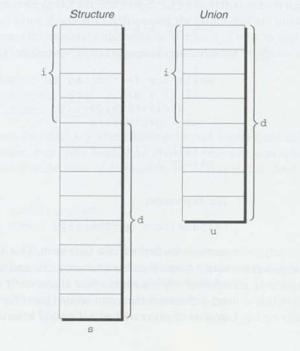

# 结构、联合与枚举

## 结构变量
结构的成员具有不用的类型，声明如下：

```
struct {
    int id;
    char name[LEN + 1];
    int age;
} victor;
```

这里的声明格式与C语言中其他变量的声明格式一致，struct {...}是变量类型，victor则是变量名。结构体的成员在内存中按序排列，访问成员时可以通过`.`操作符。

### 初始化
```
struct {
    int id;
    char name[LEN + 1];
    int age;
} victor = {1, "zhou", 25};     // 常用初始化
} victor = {.id = 1, .name = "zhou", .age = 25};     // 指定初始化(C99)
```

### 结构标记的声明
结构标记可以对结构体进行命名：
```
struct person {
    int id;
    char name[LEN + 1];
    int age;
};
```
之后使用结构标记声明变量
```
struct person victor;   // 主要struct不能少
```

### 结构类型定义
可以通过typedef来进行定义
```
typedef struct {
    int id;
    char name[LEN + 1];
    int age;
} Person;
```
之后使用定义类型来声明变量
```
Person victor;          // 不用带struct
```

## 联合

联合也是多个成员组成的，但是编译器只为占用空间最大的成员进行内存分配：

```
union {
    int i;
    double d;
} u;

struct {
    int i;
    double d;
} s;
```


通常用于进行内存空间的节省。

## 枚举
声明：
`enum {JAN, FEB, MAR, APR, ...} m1, m2;`
编译器会将成员按序设为0, 1, 2, 3...的值。


[返回目录](../CONTENTS.md)