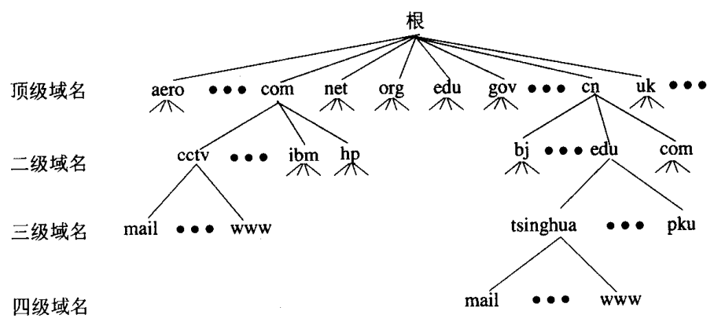
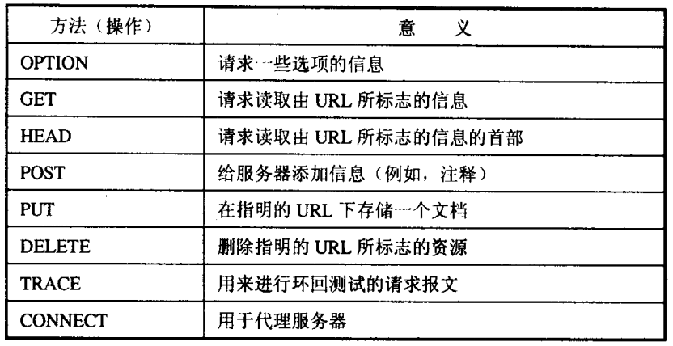

# 应用层
## 域名系统DNS
* 主机名与IP地址
* 使用UDP传输
* 因特网的域名空间

## 文件传送协议FTP
* 使用TCP可靠的运输服务

## 远程终端协议TELNET
* TELNET的选项协商（Option Negotiation）使TELNET客户和TELNET服务器可商定使用更多的终端功能，协商双方是平等的

## 万维网WWW
* 是一个分布式的超媒体（hypermedia）系统，是超文本（hypertext）系统的扩充，超文本仅包含文本信息，超媒体还包含图形、声音、视频等
* 超文本传送协议HTTP（HyperText Transfer Protocol）
    * HTTP使用了面向连接的TCP作为运输层协议，保证了数据的可靠传输
    * HTTP请求报文和响应报文都是由三部分组成的：开始行、首部行和实体主体
    * HTTP请求报文的方法
    
    * 状态码
        * 1XX表示通知信息的，2XX表示成功，3XX表示重定向，4XX表示客户端错误，5XX表示服务器错误
    * cookie用于跟踪用户
* 超文本标记语言HTML（HyperText Markup Language）
    * 通用网关接口CGI，定义了动态文档如何创建、输入数据如何提供给应用程序、输出结果如何使用

## 统一资源定位符URL
* 一般形式
    * <协议>://<主机>:<端口>/<路径>

## 动态主机配置协议DHCP
* Dynamic Host Configuration Protocol
* 提供即插即用联网（plug-and-play networking）

[返回目录](../CONTENTS.md)