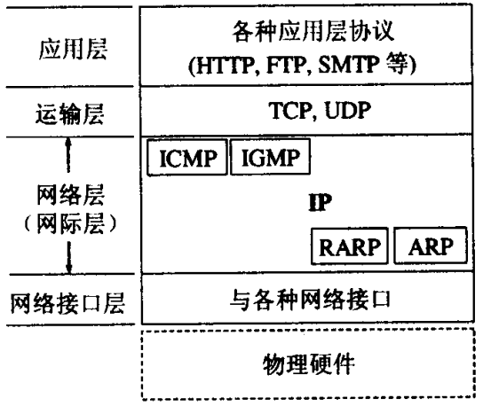
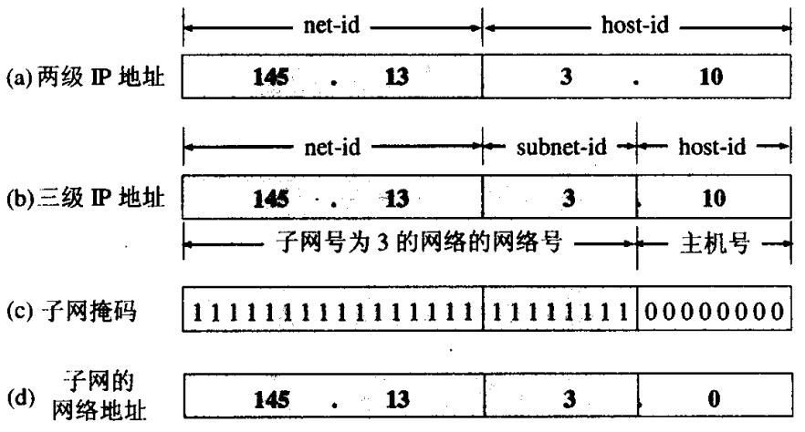

# 网络层
## 网际协议IP
* 地址解析协议ARP（Address Resolution Protocol）
    * IP地址 -> 物理地址
* 逆地址解析协议RARP（Reverse Address Resolution Protocol）
    * 物理地址 -> IP地址
* 网际控制报文协议ICMP（Internet Control Message Protocol）
    * 分为两种：ICMP差错报告报文和ICMP询问报文
* 网际组管理协议IGMP（Internet Group Management Protocol）

## 网际协议IP及其配套协议

## 常用的三种类别的IP地址
* A类地址，第一位0
    * 网络号占1个字节（网络数：$2^{7}-2$，除全0全1）
    * 主机号占3个字节（主机数：$2^{24}-2$，除全0全1）
* B类地址，前两位10
    * 网络号占2个字节（网络数：$2^{14}-1$，除全0）
    * 主机号占2个字节（主机数：$2^{16}-2$，除全0全1）
* C类地址，前三位110
    * 网络号占3个字节（网络数：$2^{21}-1$，除全0）
    * 主机号占1个字节（主机数：$2^{8}-2$，除全0全1）

* 私有IP地址范围
    * A：10.0.0.0 ~ 10.255.255.255
    * B：172.16.0.0 ~ 172.31.255.255
    * C：192.168.0.0 ~ 192.168.255.255
* IP总分类：5类
    * A（1-126），B（128-191），C（192-223），D（224-239），E（240-255）

## IP地址特点
* 每一个IP地址都由网络号和主机号组成，即：IP地址是一种分等级的地址结构
* 用转发器或网桥连接起来的若干个局域网仍为一个网络

## IP数据报的格式

* IP数据报由首部和数据两部分组成，首部由固定部分（20字节）和可变部分组成
* 标识：每产生一个数据报，计数器+1，当数据报长度超过最大传送单元MTU而必须分片时，标识字段的值被复制到所有数据报片的标识字段中，相同的标识字段值使得分片后的各数据片最后能正确地重装

## 子网掩码
* 用于将某个IP地址分成网络地址和主机地址两部分

* A类地址的默认子网掩码是255.0.0.0，B类地址的默认子网掩码是255.255.0.0，C类地址的默认子网掩码是255.255.255.0

## 两类因特网路由选择协议
* 内部网关协议IGP（Interior Gateway Protocol）
    * 自治系统内部使用的路由选择协议，如：RIP（Routing Information Protocol路由信息协议）和OSPF（Open Shortest Path First开放式最短路径有限）
    * RIP：分布式的基于距离向量的路由选择协议，距离即“跳数”，最大优点：简单
        * 协议特点：
            1. 仅和相邻路由器交换信息；
            2. 路由器交换的信息是当前本路由器的路由表（全部信息）；
            3. 按固定的时间间隔交换路由信息；
    * OSPF：分布式的链路状态协议
        * 协议特点：
            1. 向本自治系统的所有路由器发送信息，即：洪泛法（flooding）；
            2. 发送的信息是与本路由器相邻的所有路由器的链路状态（部分信息）；
            3. 只有当链路状态发生变化时，路由器洪泛此消息；
* 外部网关协议EGP（External Gateway Protocol）
    * 不同自治系统之间使用的路由选择协议，如：BGP-4（Border Gateway Protocol边界网关协议）

## 其他IP地址
* D类地址，IP地址前4位是1110，地址范围：224.0.0.0~239.255.255.255

## 网络地址转换NAT
* Network Address Translation
* 有助于减缓IP地址空间的枯竭
* 三种实现方式
    1. 静态转换Static Nat：内部网络的私有IP地址转换为公有IP地址，IP地址一对一；
    2. 动态转换Dynamic Nat：内部网络的私有IP地址转换为公用IP地址时，IP地址随机；
    3. 端口多路复用OverLoad：存在端口转换；

[返回目录](../CONTENTS.md)