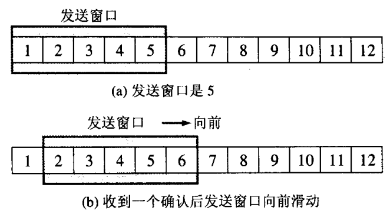
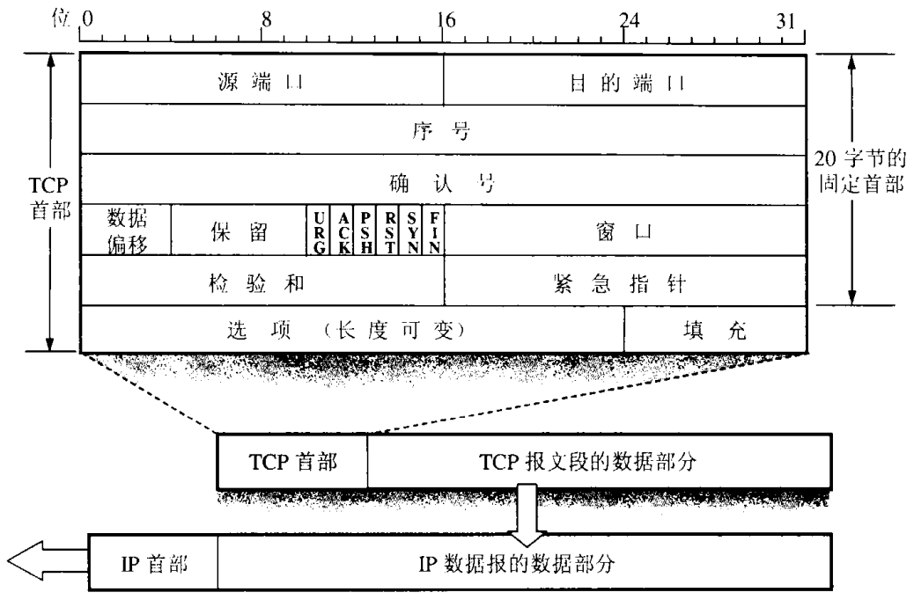
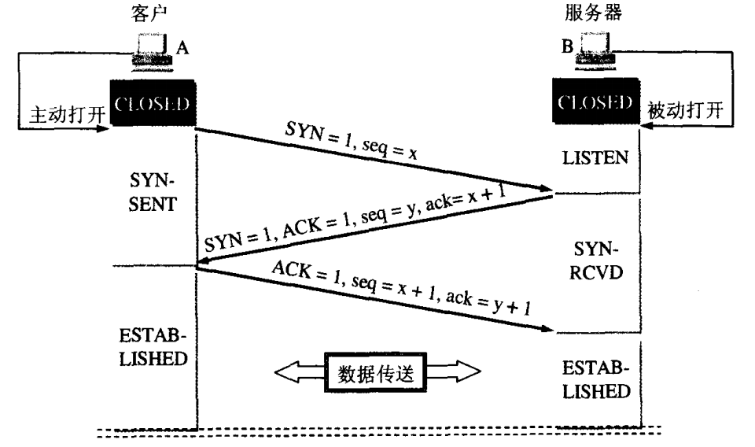

# 运输层
## 运输层的两个主要协议
* 用户数据报协议UDP（User Datagram Protocol）
* 传输控制协议TCP（Transmission Control Protocol）

## 运输层通信
* 看似水平方向传送数据，实际上报文要先传送到IP层，加上IP首部后，再传送到数据链路层，再加上数据链路层的首部和尾部后，才离开主机发送到物理链路

## 常用端口号

## UDP
* 主要特点
    1. 无连接，发送数据前不需要建立连接；
    2. 尽最大努力交付；
    3. 面向报文的：发送方的UDP对应用程序的报文，添加首部后向下交付给IP层；
* 首部格式
    * 由四个字段组成，每个字段的长度都是两个字节
    * 字段包括：源端口、目的端口、长度、检验和
        * IP数据报检验和只检验IP数据报的首部，UDP检验和将首部和数据一起检验
* udp包的最大大小是65507
    * udp数据报只在ip数据报服务上增加了很少的功能，基本复用ip数据报，ip包头有2个byte用于记录总长度（包括首部和数据之和的长度），2个byte最大可表示值为：$2^{16}-1=65535$，运输层udp包头占8字节，网络层IP包头占20字节，因此$65535-28=65507$

## TCP
* 主要特点
    1. 面向连接的运输层协议；
    2. 两个端点的点对点连接；
    3. 提供可靠交付，无差错、不丢失、不重复、按序到达；
    4. 提供全双工通信；（两端都设有发送缓存和接收缓存）；
    5. 面向字节流；
* TCP的连接
    * 两个端点即套接字 socket =（IP地址：端口号）
    * 每一条TCP连接唯一被通信两端的两个套接字确定
    * Socket通信模型

* 流水线传输
    * 涉及：连续ARQ协议和滑动窗口协议
    * 连续ARQ协议-自动重传请求 P192
        * 发送方维持一个发送窗口，在发送窗口内的分组都可以连续发送出去，而不需要等待对方的确认，目的：提高信道利用率
        * 发送方每收到一个确认，就把发送窗口向前滑动一个分组的位置
        * 接收方采用累积确认，对按序到达的最后一个分组发送确认
        * 工作原理
        
    * 滑动窗口协议 P198
        * TCP滑动窗口是以字节为单位的，假设窗口是20字节，确认号是31（表明：序号30为止的数据已经收到了），则：A发送了11个字节的数据情况为：
        
        * 虽然A的发送窗口是根据B的接收窗口设置的，但同一时刻，A的发送窗口并不总和B的接收窗口一样大，发送方可能根据网络拥塞情况适当减小发送窗口数值
        * TCP对于不按序到达的数据一般临时存放在接收窗口中，等到字节流中缺少的字节收到后，再按序交付给上层应用
        * TCP要求接收方必须有累积确认的功能，以此减小传输开销
* TCP报文段的首部格式
    * TCP报文段包括首部和数据两部分
    * 首部格式（至少20字节）
    
        * 序号：TCP连接中传送的字节流中的每一个字节都按序编号
        * 确认号：若确认号=N，则：到序号N-1为止的所有数据都已经正确收到
        * 紧急URG，=1表示TCP有紧急数据要传送
        * 确认ACK，=1表示确认号字段有效，=0表示无效
        * 窗口，表示接收方的接收缓存空间，明确指出了现在允许对方发送的数据量，窗口值是经常动态变化的
* TCP超时重传
    * TCP采用自适应算法设置运输层的超时重传时间
* TCP的流量控制
    * 利用滑动窗口实现流量控制
        * 流量控制：让发送方的发送速率不要太快，使得接收方来得及接收
        * 方式：改变窗口大小
            * 发送方窗口的上限值=Min{接收方窗口rwnd, 拥塞窗口cwnd}
* TCP拥塞控制
    * 拥塞：对资源的需求和>可用资源
    * 拥塞控制方法：慢开始、拥塞避免、快重传、快恢复
* TCP是数据流协议，因此不存在包大小的限制（暂不考虑缓冲区的大小）

## TCP的运输连接管理
* 运输连接有三个阶段，即：连接建立、数据传送、连接释放
* 三次握手建立TCP连接 P216

* 四次挥手释放TCP连接 P217

[返回目录](../CONTENTS.md)