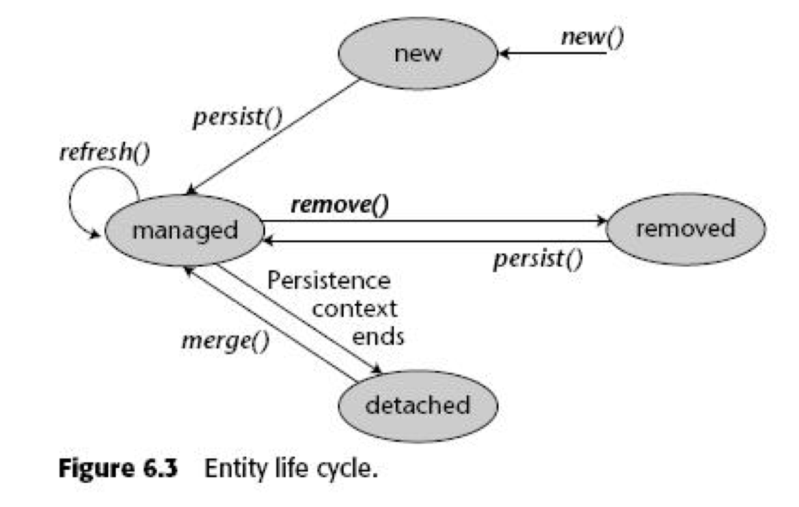

# Other
## JDBC读取数据数据的过程
* 两种建立数据库连接的方式
    1. DriverManager机制
    2. DataSource机制
    * 两者区别：DataSource是从连接池找一个连接，而DriverManager是创建一个连接
* 向数据库提交查询请求
* 读取查询结果
* 处理查询结果
* 释放连接

## MVC
* 通过控制器将模型和视图分开，单独开发，易于修改
* 三部分
    1. View：呈现给用户的界面，JSP或应用GUI
    2. Model：封装应用数据，EJB适合
    3. Controller：接受用户动作，并对应用数据进行适当处理，Servlet适合

## 中间件
* 定义：在操作系统和应用系统之间的一层软件，为分布式应用的开发、部署、运行和管理提供支持
* 技术集合
    * 远程过程调用：stub客户端代理，skeleton服务器端代理
    * 远程数据库访问：程序与数据库之间通信，如：JDBC
    * 分布式事务处理：数据库与中间件协议---XA协议，两阶段提交
    * 消息队列

## CORBA
* Common Object Request Broker Architecture，公共对象请求代理程序体系结构

## 两类Enterprise Bean
* 会话Bean
    * 同步，非持久的（数据不保存到数据库）
    * 有三种类型：
        1. 有状态（Stateful）
            * 使用场景：
                a. 特定的客户端
                b. 需要跨方法调用
                c. 客户端需要与其他组件交互
                d. 该会话Bean需要与多个EJB交互才能实现
        2. 无状态（Stateless）
            * 可以实现Web Service，但是Stateful Bean不行
        3. 单例（Singleton）
            * 仅一个会话Bean，可以实现Web Service
* 消息驱动Bean
    * 异步

## Entity Life Cycle

* 4个状态
    1. New：新建实例，容器用；
    2. Managed：有持久性标识符；
    3. Detached：分离状态；
    4. Removed：删除状态；
* 方法
    * persist()：存储到数据库，支持级联更新；
    * merge()：容器决定flush时，数据将同步到数据库中；

## JMS技术
* JMS：Java Message Service
* 应用：进程间通信，异步传递消息

[返回目录](../CONTENTS.md)