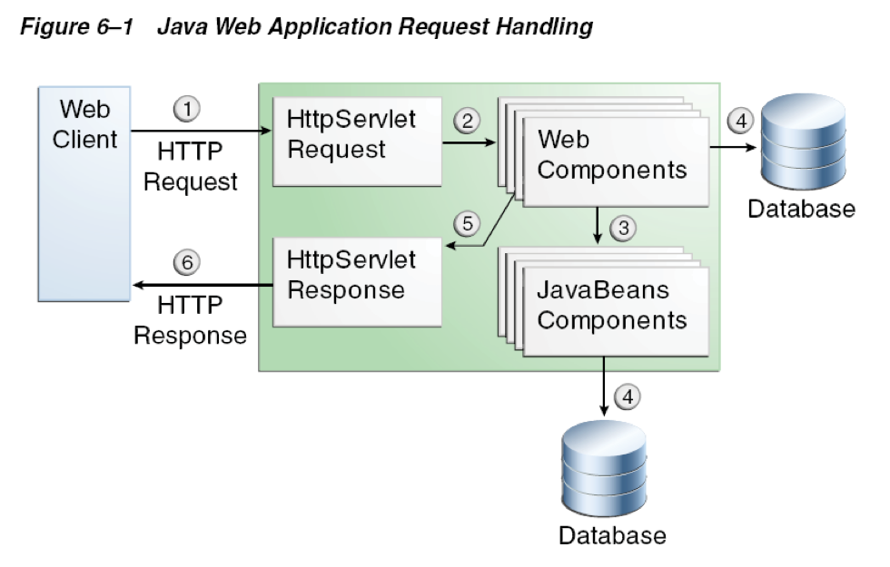
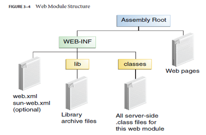

# Servlet
## Web应用请求处理过程

### 步骤：
1. client发送HTTP请求给web server
2. 采用servlet和jsp实现的web server转变请求为HTTPServletRequest对象，分发到恰当的组件上
3. Web组件和Javabean组件交互产生动态内容
4. Web组件、Javabean组件和数据库交互产生动态内容
5. Web组件生成最终的HTTPServletResponse响应对象
6. Web server将该响应对象转化为HTTP Response，返回给客户端

## HttpServlet类
* doGet和doPost方法

## web模块结构

* Assembly Root：根目录包括子文件夹WEB-INF
* WEB-INF包括：
    1. classes：包括服务器端类
    2. tags：自定义标签或标签库
    3. lib：jar文件
    4. 部署描述文件：web应用是web.xml，EJB应用是ejb-jar.xml

## Servlet技术
* 是服务器端的小程序，用于扩展服务器的能力
* Servlet技术默认是多线程的，request和response是线程安全的
* Servlet生命周期由所属容器控制
* 当客户端请求发送到服务器时，容器执行以下步骤
    1. 如果servlet实例不存在
        a. 加载servlet类；
        b. 创建一个servlet实例；
        c. 调用init方法初始化实例
    2. 调用service方法，传递request和response对象
    3. 移除servlet时，调用destroy()释放
* 注释为@WebServlet

## 开发HttpServlet步骤
1. 扩展HttpServlet类；
2. init() { super.init() }；
3. 定制service()方法；

## DTD文档类型定义
* Document Type Definition
* 定义了XML文档的结构和元素的顺序

## Session
* Web应用采用session跟踪应用的状态
* session有timeout机制，过时失效
* Web容器在客户端和服务器端传送标识符Session ID
* Session实现的两种机制：Cookie机制和URL重写
* https://www.cnblogs.com/xdp-gacl/p/3855702.html

## Cookie机制
### 步骤：
1. 用户第一次访问站点，创建新的会话对象（Httpsession），Server分配唯一的标识号（sessionID）
2. Server创建一个暂时的HTTP cookie
3. 客户浏览器发送包含Cookie的请求
4. 根据客户机浏览器发送的sessionID信息（Cookie），Server找到相应的HttpSession对象，跟踪会话
5. 会话超时则失效

## URL重写
###步骤：
1. 用户第一次访问站点，创建新的会话对象（Httpsession），Server分配唯一的标识号（sessionID）
2. Server将sessionID放在返回给客户端的URL中
3. 客户浏览器发送包含sessionID的请求
4. 根据包含请求的sessionID信息（URL），Server找到相应的HttpSession对象，跟踪会话
5. 会话超时则失效

## 四种作用域对象
* Web Context
* Session（一个人多个页面）
* Request（一次请求）
* Page（用于JSP）

## 过滤器
* 多个filter按照web.xml中filter-mapping出现的顺序运行
* 主要任务包括：
    * Query：查询请求并act
    * Block：拦截
    * Modify：修改请求/响应
    * Interact：与其他资源交互
* 注释为@WebFilter

## 监听器
* 对生命周期进行管理
* 例如：统计访问web应用的次数
* 注释为@WebListener

[返回目录](../CONTENTS.md)