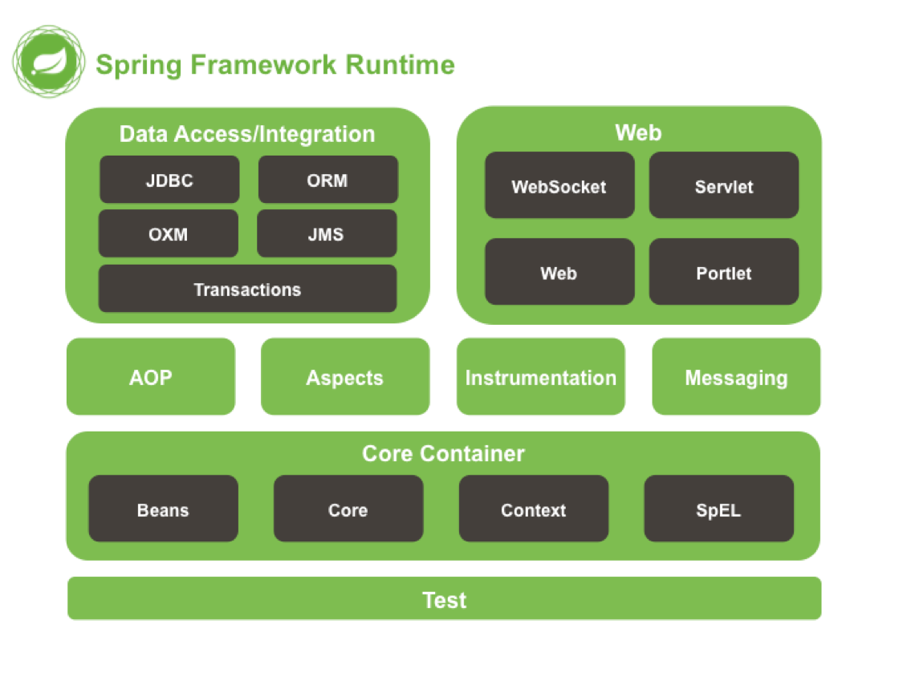
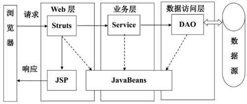

# SSH
## Hibernate
* API
    * 映射文件hibernate.cfg.xml；
    * SessionFactory：用户程序从中取得Session实例，是线程安全的；
    * ConnectionProvider 生成JDBC连接的工厂；
    * Session 持久层管理器，轻量级的类；
    * Transaction 对实际事务实现的抽象，是单线程的；
* 向数据库添加记录
    * 建立SessionFactory；
    * 使用SessionFatory类的openSession方法获得一个Session对象；
    * 使用Session接口的openTransation方法开始一个新事物；
    * 使用Session接口的save方法保存实例；
    * 成功commit，失败rollback；
    * 关闭Session对象；
* HQL
    * Hibernate Query Language
    * 面向对象的查询语言，查询以对象形式存在的数据
* Web应用中的线程安全
    * ResultSet、Statement和Hibernate中的Session等对象，不是线程安全的
    * 可通过ThreadLocal类，产生可重入的线程安全的代码
    * Hibernate提供的HibernateUtil类

## Spring
* Spring模块

    * 所有模块都建立在核心容器上，容器规定如何创建、配置和管理bean等
    * 数据访问/集成模块
        * 包括JDBC、ORM、OXM、JMS和Transactions模块
            * ORM模块：Object/Relation Mapping对象关系映射，包含JPA、JDO和Hibernate
    * Web模块
        * portlet模块：处理request并产生动态内容
            * portal：提供个性化，单点登录，不同源的内容聚合，与表示层集中

* 反向控制-loC
    * 思路
        * 依赖倒置原则（DIP）的实现
            * Bob Martins对DIP的定义
                * 高层模块不应该依赖于低层模块，两者应该依赖于抽象；
                * 抽象不应该依赖于实现，实现应该依赖于抽象；
    * 特点
        * 实现松耦合；
        * 对象被动接收依赖类而不是主动寻找；
        * JNDI的反转；
* 面向切面-AOP
    * 思路
        * 使用“横切”技术，将软件系统分为两个部分：核心关注点和横切关注点
    * 主要处理
        * 日志记录、性能统计、安全控制、事务处理、异常处理
    * 特点
        1. 将业务逻辑从系统中分离出来；
        2. 内聚开发；
        3. 将服务模块化；
    * 使用案例
        * https://www.cnblogs.com/hongwz/p/5764917.html
* 容器
    * 包含并管理系统对象的生命周期和配置
    * Spring模块的核心容器
        * Beans；
        * Core；
        * Context；
        * spEL；

## struts

* Struts2工作流程：
    1. 请求资源；
    2. Filter Dispatcher确定action；
    3. Interceptors（拦截器）；
    4. Action方法执行；
* Action、Service、DAO层的设计

## example
* Struts -> Action
* Spring -> Dao、Service
* Hibernate -> Model