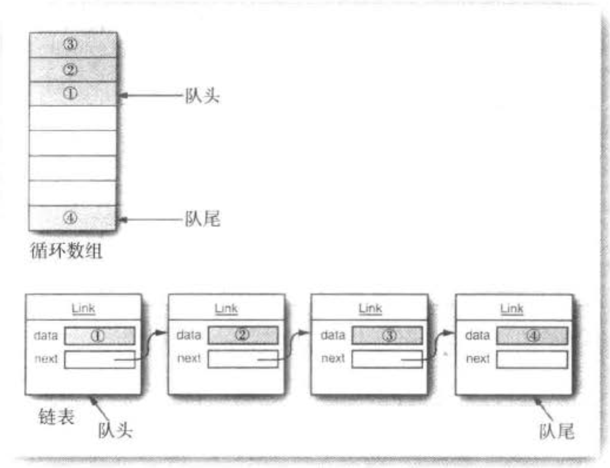

# Collection集合类

## 队列接口
### 接口形式
```
interface Queue<E>{
    void add(E element);
    E remove();
    int size();
}
```
### 实现途径
* 循环列表
* 链表



## 集合接口与迭代器接口
### 集合接口形式
```
interface Collection<E>{
    // 向集合添加元素，如果结果改变了集合，返回true
    boolean add(E element);
    // 向集合添加other中的所有元素，如果结果改变了集合，返回true
    boolean addAll(Collection<? extends E> other);
    // 返回用于依次访问集合中元素的对象
    Iterator<E> iterator();
    // 返回当前集合的元素个数
    int size();
    // 当集合中不存在元素，返回true
    boolean isEmpty();
    // 如果集合中包含一个与obj相同的对象，返回true
    boolean contains(Object obj);
    // 如果集合中包含与other集合的所有元素，返回true
    boolean containsAll(Collection<?> other);
    // 从集合中删除与obj相同的元素，如有对象被删除，返回true
    boolean remove(Object obj);
    // 从集合中删除other集合的所有元素，如改变了集合内容，返回true
    boolean removeAll(Collection<?> other); 
    // 删除集合中的所有元素
    void clear();
    // 从集合中删除所有与other集合中元素不同的元素，如改变了集合内容，返回true
    boolean retainAll(Collection<?> other);
    // 返回这个集合的对象数组
    Object[] toArray();
    // 返回这个集合的对象数组，如果arrayToFill足够大，就将元素填入这个数组中，剩余空位         
    //填null；否则，分配一个新数组，成员类型与arrayToFill一样，长度等于集合长度，并填
    //入元素
    <T> T[] toArray(T[] arrayToFill);
}
```
### 迭代器接口形式
```
interface Iterator<E>{
    // 查找下一个元素，与当前指向元素密切相关
    E next();
    // 判断当前指向的元素后面是否还存在元素
    boolean hasNext();
    // 移除当前指向的元素，必须配合next函数使用
    void remove();
}
```
* for each也可用于便利集合内元素，本质是带有迭代器的循环；可以使用在任何实现了Iterable接口的对象，该接口仅包含一个方法： Iterator<E> iterator()
* 元素被访问的顺序取决于集合类型，ArrayList被迭代时按照索引从0开始，HashSet被迭代时按照随机的顺序

## 具体集合
### 1. 链表
* 删除元素和在某位置插入元素代价很小
* Java中一般是双向链表
* 在尾部插入元素依靠链表的add方法
* 在中间插入元素依靠Iteator的add方法
### 2. 数组列表
* 适合使用get和set方式随机访问元素
* Vector类是同步的，不同线程可以安全的访问Vector
* ArrayList是非同步的，但是执行速度快
### 3. 散列集
* 散列表（HashTable）由链表数组实现，每个链表是被称为一个桶（bucket）
* HashSet是基于HashTable实现的，contains方法不用对所有元素进行遍历，所以时间上更快
### 4. 树集
* TreeSet与散列集相似，但是它是有序集合，所有对象都被排序
* 实现方式是红-黑树
### 5. 对象比较
* 在有序集合中，对象的比较是通过Comparable接口实现
* 接口中有一个int compareTo(T other)方法。对于a.compareTo(b)来说，当a与b相等，将返回0；a在b之前，返回负值；a在b之后，返回正值
* 当无法定义Comparable接口时，可以利用Comparator对象实现和Comparable一样的功能，并将其传给TreeSet
### 6. 队列与双端队列
* 可以在队列头部和尾部同时添加和删除元素
* 由ArrayDeque和LinkedList实现
### 7. 优先级队列
* 按照任意顺序插入，但是按照优先级的顺序查找
* 利用堆（heap）实现，本质是一个可以自我调节的二叉树，优先级最高的元素总是在根部
* 可以实现Comparable接口
### 8. 映射表
* map是键/值对存储的，依靠key来进行索引
* 两个通用实现，HashMap和TreeMap
* HashMap对键进行散列后存储，TreeMap对键进行比较后有序的存储
* 键必须是唯一的
* keySet()函数返回的不是HashSet或TreeSet，而是另一个实现了Set的对象
### 9. 专用集与映射表类
* WeakHashMap：当对键的引用只有散列表有引用时，就可以删除键/值对，通过WeakReference对象实现
* LinkedHashSet&LinkedHashMap：所有对象被双链表连接，每次在get和put时，条目都会从当前位置删除，挪到链表末尾，可以用于实现“最近最少使用”原则
* EnumSet：枚举类型元素集的高效实现，只有静态工厂方法
* IdentityHashMap：不适用hashCode函数进行散列，而是通过System.identityHashCode实现，对hash的比较是通过“==”而不是“equals”