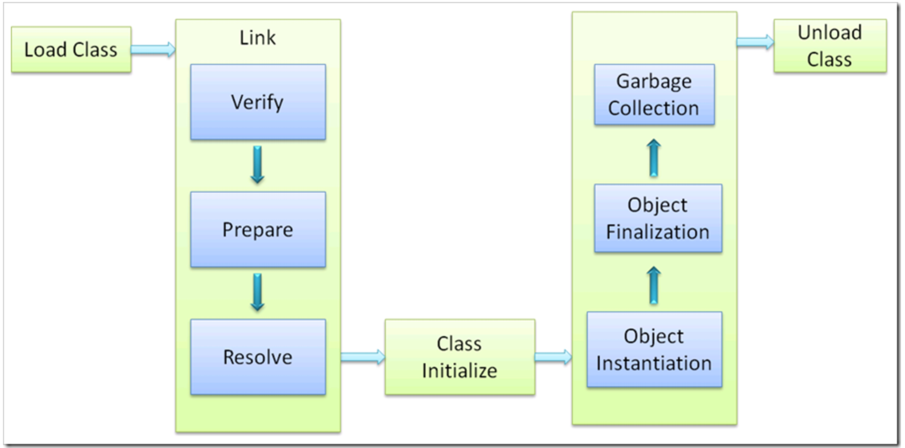

# 类加载机制
>Class文件的生命周期：加载（Loading）、验证（Verification）、准备（Preparation）、解析（Resolution）、初始化（Initialization）、使用（Using）、卸载（Unloading）

## 类的加载时机
* 遇到new、getstatic、putstatic、invokestatic时，当类没有进行过初始化，则需要先触发其初始化
* 使用java.lang.reflect包的方法对类进行反射调用的时候
* 当初始化一个类时，发现其父类没有初始化，则先触发其父类的初始化
* 虚拟机启动时，会先初始化包含main()方法的类
* 使用JDK1.7的动态语言支持时，当java.lang.invoke.MethodHandle实例最后的解析结果REF_getStatic、REF_putStatice、REF_invokeStatic的方法句柄，并且这个方法所对应的句柄所对应的类没有进行初始化

## 加载（Loading）
* 通过类的全限定名来获取定义此类的二进制字节流
* 将这个字节流所代表的静态存储结构转化为方法区的运行时数据结构
* 在内存中生成一个代表这个类的java.lang.Class对象，作为方法区这个类的各种数据的访问入口

## 验证（Verification）
* 文件格式的检验：是否以0xCAFEBABE开头、主次版本号是否在虚拟机处理的范围内等
* 源数据验证：进行语义校验，防止存在不符合Java语言规范的元数据信息
* 字节码验证：通过数据流和控制流分析，确定程序语义是合法，符合逻辑的
* 符号引用验证：对类自身以外的信息进行匹配性校验

## 准备（Preparation）
正式为类变量（被static修饰的变量）分配内存并设置类变量初始值的阶段，这些变量所使用的内存都将在方法区中进行分配。

在此阶段，类变量如果不是final，则初始值为数据类型的默认值，如果是final，则初始化为被赋的值。

## 解析（Resolution）
将常量池内的符号引用替换为直接引用的过程
* 符号引用：用符号描述所引用的目标，可以是任何形式的字面量，与虚拟机的内存布局无关
* 直接引用：是直接指向目标的指针，偏移量或者句柄，与内存的布局有关

## 初始化（Initialization）
* 是类加载过程的最后一步
* 是执行\<clinit\>()方法的过程
    * 编译器自动收集类中的所有类变量的赋值动作和静态语句块，静态语句块只能访问到定义在块之前的变量，定义在它之后的变量，只能赋值，不可访问
    * 在子类的\<clinit\>()方法执行之前，父类的\<clinit\>()方法已经执行完毕
    * 对于类或接口不是必须的，如无静态语句块和变量赋值操作，就不需要生成\<clinit\>()方法
    * 接口中不能使用静态语句模块
    * 多线程同时初始化一个类时，只会有一个线程执行\<clinit\>()方法，其他线程都要等待\<clinit\>()方法被执行完毕

[返回目录](../CONTENTS.md)