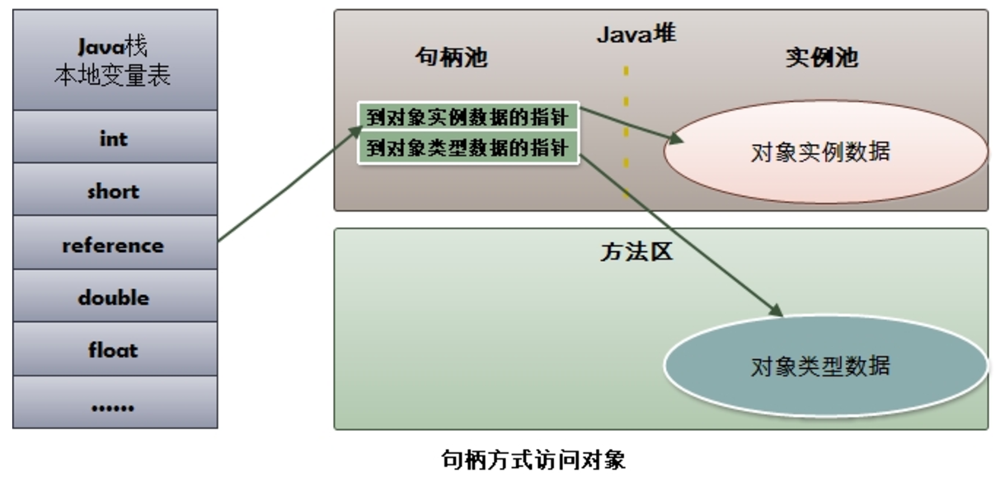
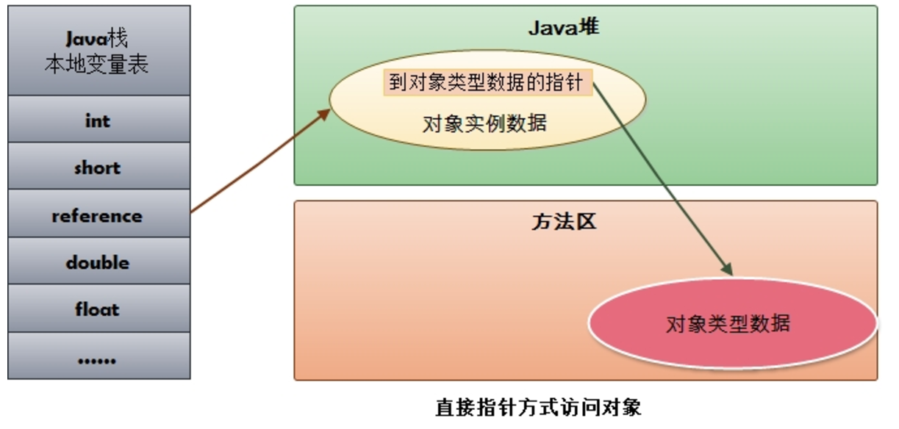

# 对象访问定位
Java程序需要通过栈上的reference数据来操作堆上的具体对象。对象的访问方式分为两种

## 句柄访问
Java堆中将划分出一块内存作为句柄池，reference存储对象的句柄地址，句柄中包含了对象实例数据与类型数据各自的具体地址信息

优点：
* 当对象移动的时候（垃圾回收的时候移动很普遍），这样只需要改变句柄中的指针，但是栈中的指针不需要变化，因为栈中存储的是句柄的地址

缺点：
* 需要进行二次定位，寻找两次指针，开销相对于更大一些

## 直接指针访问
reference存储的直接就是对象的地址

优点：
* 速度快，不需要和句柄一样指针定位的开销

[返回目录](../CONTENTS.md)