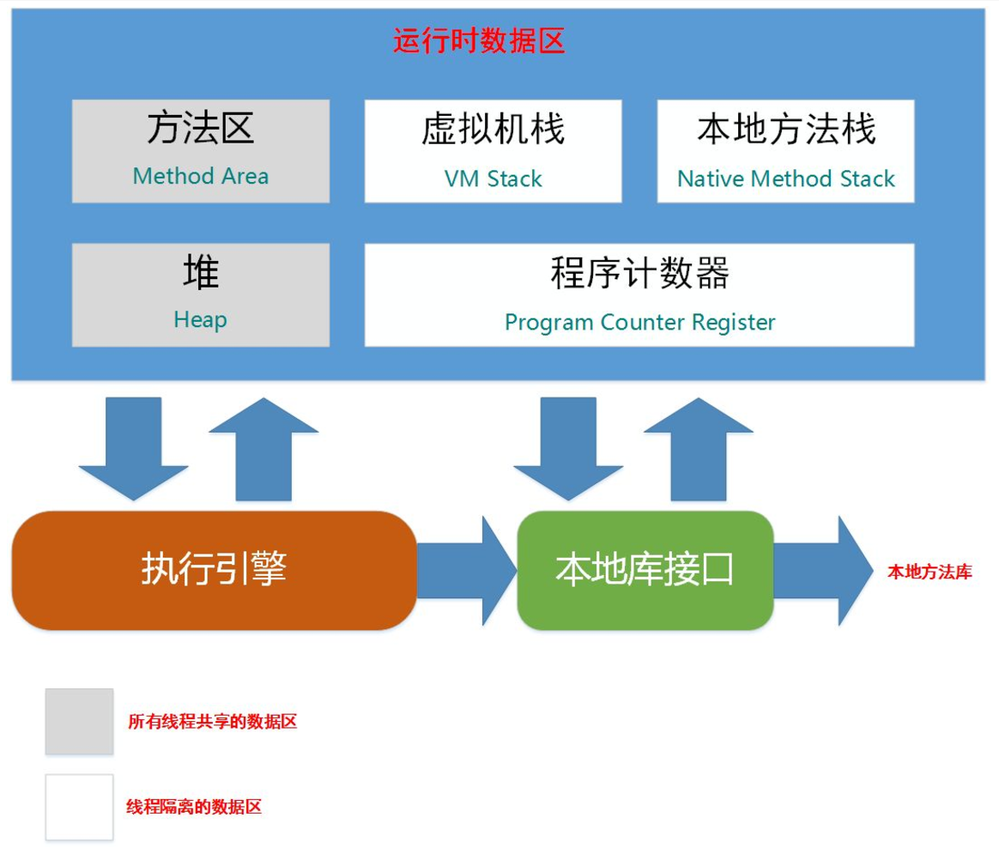

# 运行时数据区域

## 程序计数器（Program Counter Register）

* 是一块较小的内存空间，是当前线程所执行的字节码的行号指示器
* 线程私有的
* 执行Java方法时，记录字节码指令的地址；执行Native方法时，值为空（Undefined）
* 是唯一在Java虚拟机规范中没有定义OutOfMemoryError情况的区域

## Java虚拟机栈（Java Virtual Machine Stacks）

* 生命周期与线程相同
* 线程私有的
* 每个方法被执行的时候都会同时创建一个栈帧（Stack Frame）用于存储：
    * 局部变量表
        * 以Slot为最小单位
        * 能存放：boolean、byte、char、short、int、float、long、double、reference（对象引用）、returnAddress（指向一条字节码指令的地址）类型
        * long、double将占用2个Slot
    * 操作数栈
        * 与局部变量表相似，但是不是依靠索引访问，而是通过入栈、出栈来访问
    * 动态链接
    * 方法出口
* 当线程请求的栈深度大于虚拟机允许的深度时，将抛出StackOverFlowError异常
* 当虚拟机栈在动态扩展时无法申请到足够的空间时，将会抛出OutOfMemoryError异常

## 本地方法栈（Native Method Stack）

* 线程私有的
* 执行Native方法所用
* 对数据结构没有具体要求
* 会抛出StackOverFlowError异常、OutOfMemoryError异常

## Java堆（Heap）

* 虚拟机启动时被创建
* 被所有线程共享
* 几乎所有的对象实例在堆中分配内存
* 垃圾收集器管理的主要区域
* 逻辑上连续的空间
* 如无内存完成实例分配，并且堆无法再扩展时，将抛出OutOfMemoryError异常

## 方法区（Method Area）

* 线程共享的内存区域
* 加载类信息、常量、静态变量、即时编译器编译后的代码等数据
* 此区域的垃圾回收行为很少出现
* 无法满足内存分配需求时，将抛出OutOfMemoryError异常

## 运行时常量池（Runtime Constant Pool）

* 是方法区的一部分
* 用于存放编译器生成的各种字面量和符号引用
* 常量池无法申请到内存时会抛出OutOfMemoryError异常

## 直接内存（Direct Memory）

* 不是虚拟机运行时数据区的一部分
* NIO类引入了基于通道（Channel）与缓冲区（Buffer）的I/O方式，使用Native方法直接在堆外内存直接分配内存
* 当所有内存与直接内存的总和大于物理内存时，将抛出OutOfMemoryError异常

[返回目录](../CONTENTS.md)