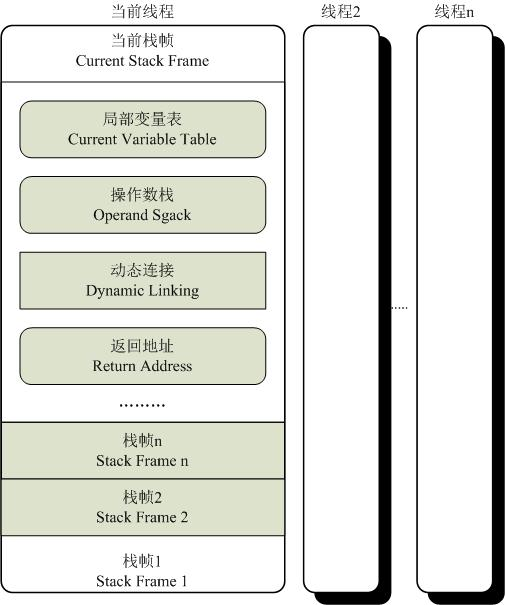
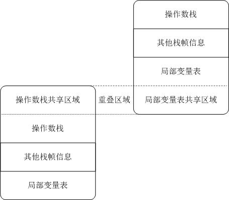

# 运行时栈帧结构
**栈帧（Stack Frame）** 是用于支持虚拟机进行方法调用和方法执行的数据结构，它是虚拟机运行时数据区的**虚拟机栈（Virtual Machine Stack）** 的栈元素。栈帧存储了方法的局部变量表，操作数栈，动态连接和方法返回地址等信息。第一个方法从调用开始到执行完成，就对应着一个栈帧在虚拟机栈中从入栈到出栈的过程。

在编译代码的时候，栈帧中需要多大的局部变量表，多深的操作数栈都已经完全确定了，并且写入到了方法表的Code属性中。对于执行引擎来讲，活动线程中，只有虚拟机栈顶的栈帧才是有效的，称为**当前栈帧（Current Stack Frame）**，这个栈帧所关联的方法称为**当前方法（Current Method）**。

## 局部变量表
* 在Java程序编译为Class文件时，就在方法表的Code属性的max_locals数据项中确定了该方法需要分配的最大局部变量表的容量
* 通过索引定位方式使用局部变量表，范围是从0~最大Slot数量
* 在方法执行时，如果是实例方法，那么局部变量表中的第0位索引的Slot默认是用于传递方法所属对象实例的引用，在方法中可以通过关键字“this”来访问这个隐含的参数，其余参数则按照参数列表的顺序来排列，占用从1开始的局部变量Slot，参数表分配完毕后，再根据方法体内部定义的变量顺序和作用域来分配其余的Slot
* 局部变量表中的Slot是可重用的，方法体中定义的变量，其作用域并不一定会覆盖整个方法，如果当前字节码PC计算器的值已经超出了某个变量的作用域，那么这个变量对应的Slot就可以交给其它变量使用
* 局部变量不像前面介绍的类变量那样存在“准备阶段“，局部变量不会被赋值系统的默认值，如果一个局部变量定义了但没有赋初始值是不能使用的

## 操作数栈

* 操作数栈的最大深度也是编译的时候被写入到方法表的Code属性的max_stacks数据项中
* 操作数栈的每一个元素可以是任意Java数据类型，包括long和double。32位数据类型所占的栈容量为1（4字节），64位数据类型所占的栈容量为2（8字节）
* 当一个方法刚刚执行的时候，这个方法的操作数栈是空的，在方法执行的过程中，会有各种字节码指向操作数栈中写入和提取值，也就是入栈与出栈操作
* 在概念模型中，两个栈帧作为虚拟机栈的元素，相互之间是完全独立的，但是大多数虚拟机的实现里都会作一些优化处理，令两个栈帧出现一部分重叠。让下栈帧的部分操作数栈与上面栈帧的部分局部变量表重叠在一起，这样在进行方法调用返回时就可以共用一部分数据，而无须进行额外的参数复制传递了

## 动态连接
* 每个栈帧都包含一个指向运行时常量池中该栈帧所属方法的引用，持有这个引用是为了支持方法调用过程中的动态连接
* 在Class文件的常量池中存有大量的符号引用，字节码中的方法调用指令就以常量池中指向方法的符号引用为参数。这些符号引用一部分会在类加载阶段或第一次使用的时候转化为直接引用，这种转化称为静态解析
* 另外一部分将在每一次的运行期期间转化为直接引用，这部分称为动态连接

## 方法返回地址
* 当一个方法被执行后，有两种方式退出这个方法：
    * 第一种方式是执行引擎遇到任意一个方法返回的字节码指令，这时候可能会有返回值传递给上层的方法调用者（调用当前方法的的方法称为调用者），是否有返回值和返回值的类型将根据遇到何种方法返回指令来决定，这种退出方法方式称为正常完成出口（Normal Method Invocation Completion）
    * 另外一种退出方式是，在方法执行过程中遇到了异常，并且这个异常没有在方法体内得到处理，无论是Java虚拟机内部产生的异常，还是代码中使用throw字节码指令产生的异常，只要在本方法的异常表中没有搜索到匹配的异常处理器，就会导致方法退出，这种退出方式称为异常完成出口（Abrupt Method Invocation Completion）。一个方法使用异常完成出口的方式退出，是不会给它的调用都产生任何返回值的
    
* 方法退出的过程实际上等同于把当前栈帧出栈：
    * 恢复上层方法的局部变量表和操作数栈
    * 把返回值（如果有的话）压入调用栈帧的操作数栈中
    * 调用PC计数器的值以指向方法调用指令后面的一条指令

[返回目录](../CONTENTS.md)