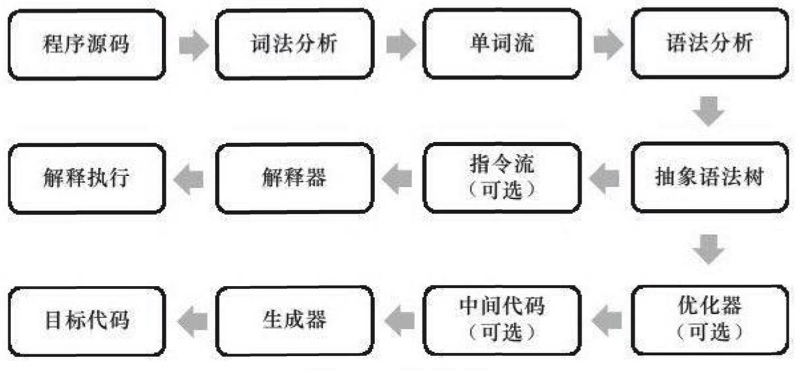
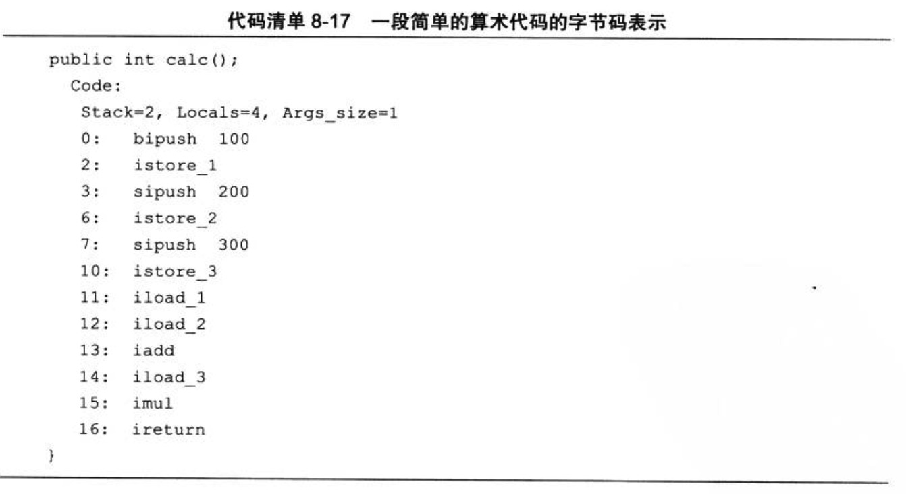
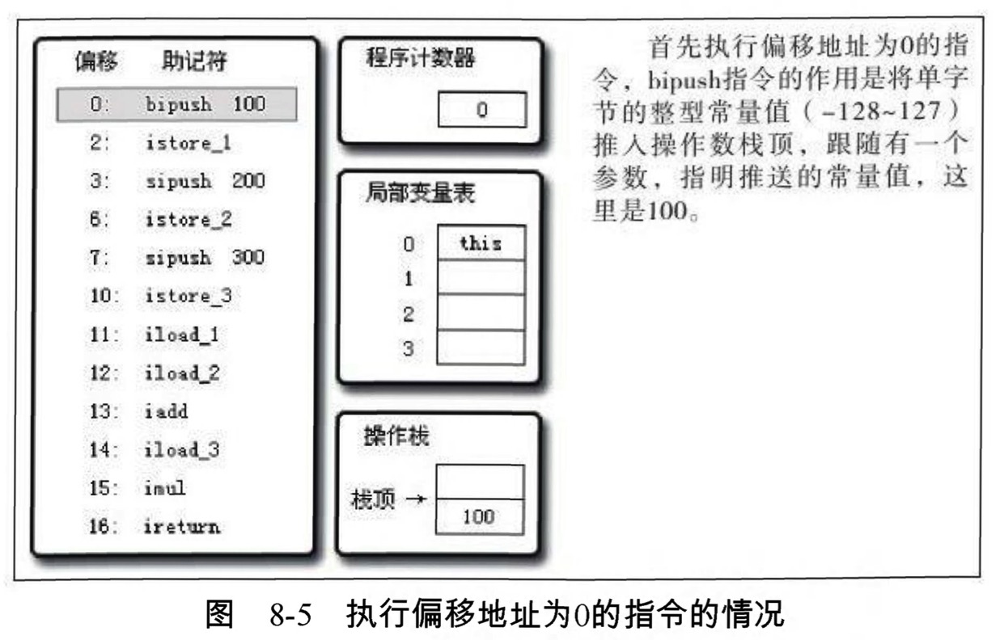
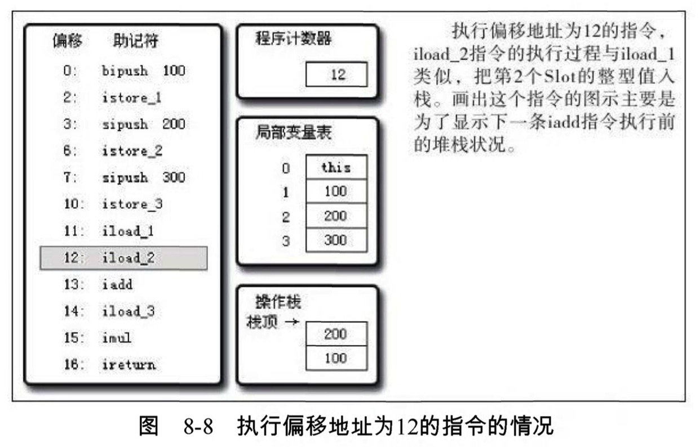
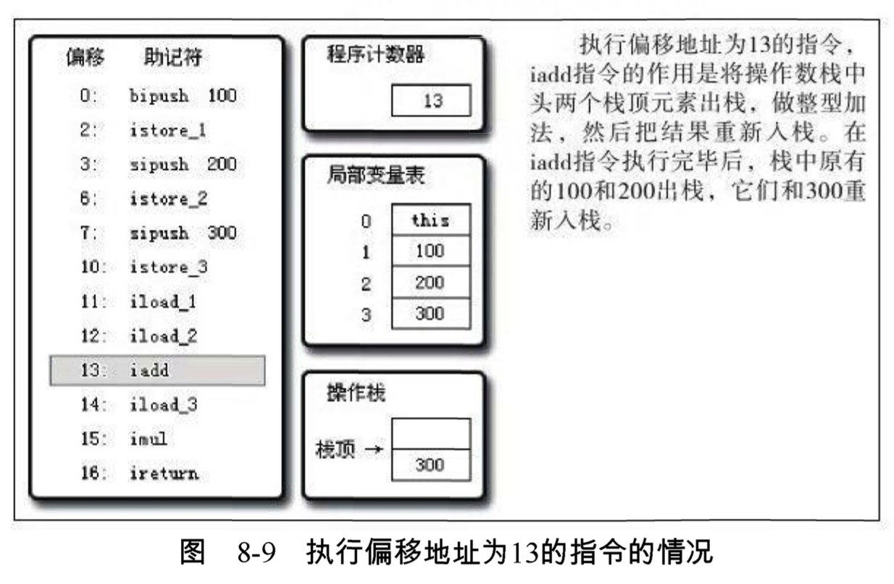
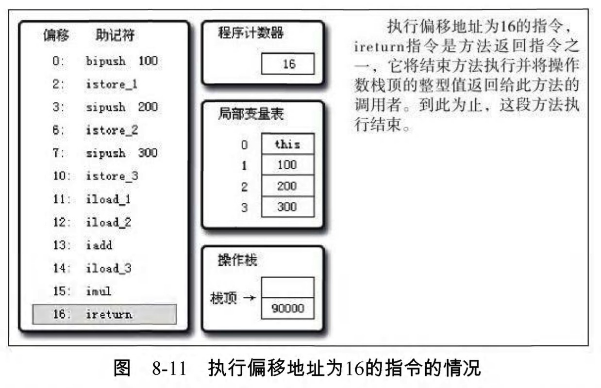

# 基于栈的字节码解释执行引擎
Java语言中 ，Javac编译器完成了程序代码经过词法分析、语法分析到抽象语法树，再遍历语法树生成线性的字节码指令流的过程。因为这一部分动作是在Java虚拟机之外进行的，而解释器在虚拟机的内部，所以Java程序的编译就是半独立的实现。



## 基于栈的指令集与基于寄存器的指令集
* Java编译器输出的指令流，基本上是一种基于栈的指令集架构（Instruction Set Architecture，ISA）指令流中的指令大部分都是零地址指令，它们依赖操作数栈进行工作。
    ```
    iconst_1
    iconst_1
    iadd
    istore_0
    ```
    * 基于栈的指令集主要的优点就是可移植
    * 栈架构指令集的主要缺点是执行速度相对来说会稍慢一些
    * 虽然栈架构指令集的代码非常紧凑，但是完成相同功能所需的指令数量一般会比寄存器架构多，因为出栈、入栈操作本身就产生了相当多的指令数量
* x86的二地址指令集
    ```
    mov eax ,1
    add eax ,1
    ```

## 基于栈的解释器执行过程


从Java语言的角度来看，这段代码没有任何解释的必要



具体执行步骤由下图表示：











[返回目录](../CONTENTS.md)