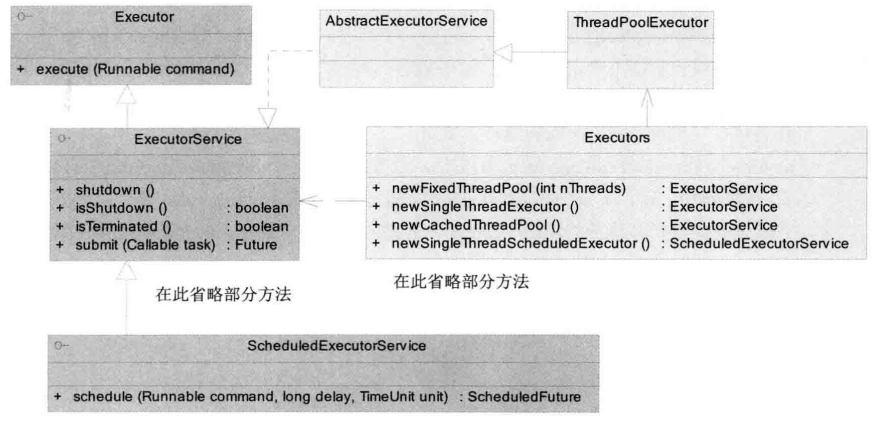

# 线程池
## 定义
* 为避免系统频繁地创建和销毁线程，让创建的线程复用

* Executors是一个静态工厂类，可以取得特定功能的线程池

## 不同特性的线程池（Executors中获取）
* newFixedThreadPool()
    * 返回固定数量的线程池
    * 当有新任务提交时，线程池中若有空闲线程，则立即执行，否则将任务放入任务队列
* newSingleThreadExecutor()
    * 返回只有一个线程的线程池
* newCachedThreadPool()
    * 返回一个可以根据实际情况调整线程数量的线程池，任务增多线程增加，任务减少线程减少
* newScheduledThreadPool()
    * 返回可指定线程数量的ScheduledExecutorService对象的定时线程池，可以：1）给定时间执行某任务（schedule()）；2）周期性执行某任务（scheduleAtFixedRate()）；3）固定延迟后，周期性执行某任务（scheduleWithFixedDelay()）。

## ThreadPoolExecutor线程池类
* 关键构造函数参数
    * corePoolSize：核心线程池的大小，默认情况下，线程池中的线程数为0，当有任务来之后，就会创建一个线程去执行任务，当线程池中的线程数目达到corePoolSize后，就会把到达的任务放到缓存队列当中；
    * maximumPoolSize：线程池最大线程数
    * keepAliveTime：表示线程没有任务执行时最多保持多久时间会终止。默认情况下，只有当线程池中的线程数大于corePoolSize时，keepAliveTime才会起作用，直到线程池中的线程数不大于corePoolSize
    * unit：参数keepAliveTime的时间单位
    * workQueue：阻塞队列，用来存储等待执行的任务
* 关键数据结构
    * `HashSet<Worker> workers`：一个worker对应一个线程，线程池通过workers包含多个线程
    * `BlockingQueue<Runnable> workQueue`：当线程池中的线程数超过容量，任务提交后，进入阻塞队列
* 关键方法
    * execute()：核心方法，向线程池提交一个任务，并执行
    ```
    public void execute(Runnable command) {
        if (command == null)
            throw new NullPointerException();
        int c = ctl.get();
        // 如果线程池中当前线程数小于核心池大小
        if (workerCountOf(c) < corePoolSize) {
            // addWorker
            if (addWorker(command, true))
                return;
            c = ctl.get();
        }
        // 如果当前线程池处于RUNNING状态，则将任务放入缓存队列
        if (isRunning(c) && workQueue.offer(command)) {
            int recheck = ctl.get();
            // 下面：为防止将任务添加进任务缓存队列时，其他线程调用shutdown或shutdownNow关闭线程池
            if (! isRunning(recheck) && remove(command))
                reject(command);
            else if (workerCountOf(recheck) == 0)
                addWorker(null, false);
        }
        // 否则addWorker
        else if (!addWorker(command, false))
            // 如果失败，拒绝任务处理
            reject(command);
    }
    ```
    * addWorker()
    ```
    Worker w = new Worker(firstTask);
    final Thread t = w.thread;
    // Worker实现Runnable接口，有run方法
    ```  

## 使用
```
import java.io.Serializable;
import java.util.concurrent.ArrayBlockingQueue;
import java.util.concurrent.ThreadPoolExecutor;
import java.util.concurrent.TimeUnit;

public class ThreadPoolExecutorDemo {

    static int consumeTaskSleepTime = 5;

    public static void main(String[] args) {
        //构造一个线程池，阻塞队列小，会有部分任务丢失
        ThreadPoolExecutor threadPool = new ThreadPoolExecutor(2, 4, 200,
                TimeUnit.MILLISECONDS,
                new ArrayBlockingQueue<>(5),
                new ThreadPoolExecutor.DiscardOldestPolicy());
        // 其中：ThreadPoolExecutor.DiscardOldestPolicy()是任务拒绝策略：丢弃队列最前面的任务，然后重新尝试执行任务
        for (int i = 1; i <= 20; i++) { //定义最大添加20个线程到线程池中
            try {
                //一个任务，并将其加入到线程池
                String work = "work@ " + i;
                System.out.println("put ：" + work);
                threadPool.execute(new ThreadPoolTask(work));
                //便于观察，等待一段时间
                Thread.sleep(1);
            } catch (Exception e) {
                e.printStackTrace();
            }
        }
    }

    /**
     * 线程池执行的任务
     */
    public static class ThreadPoolTask implements Runnable, Serializable {
        private static final long serialVersionUID = 0;
        //保存任务所需要的数据
        private Object threadPoolTaskData;

        ThreadPoolTask(Object works) {
            this.threadPoolTaskData = works;
        }

        public void run() {
            //处理一个任务
            System.out.println("start------" + threadPoolTaskData);
            try {
                //便于观察，等待一段时间
                Thread.sleep(consumeTaskSleepTime);
            } catch (Exception e) {
                e.printStackTrace();
            }
            threadPoolTaskData = null;
        }
    }
}
```

[返回目录](../CONTENTS.md)