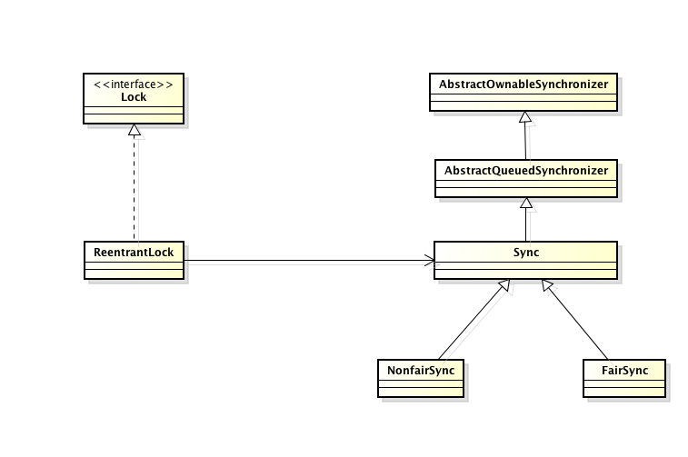

# 线程安全
>当多个线程访问某个类时，不管运行时环境采用何种调度方式或者这些线程将如何交替运行，并且在主调试代码中不需要任何额外的同步或者协同，这个类都能表现出正确的行为，则称这个类是线程安全的。线程安全类中封装了必要的同步机制，因此客户端无须进一步采取同步措施。

## Java中各种操作共享数据
### 不可变
* 不可变的对象一旦被建立，其外部的可见状态永远也不会改变，故是安全的
* 一般为final修饰的数据，String、java.lang.Number的部分子类等

### 绝对线程安全
* 无论运行时环境如何，调用者都不需要任何额外的同步措施
* 付出代价过大，甚至是不切实际的代价

### 相对线程安全
* 通常意义的线程安全
* 单独的操作是线程安全的
* 对于特定顺序的连续调用，就可能需要在调用端使用额外的同步手段来保证调用的正确性

### 线程兼容
* 对象本身不是线程安全的，但是在调用端正确的使用同步手段来保证对象在并发环境中可以安全的使用
* Vector和HashTable对应的ArrayList和HashMap等就属于线程兼容的

### 线程对立
* 无论是否采取同步措施，都无法正确执行并发
* Thread类中的suspend()和resume()方法，无论是否进行同步，并发进行的话都会出现死锁

## 实现线程安全
### 互斥同步（Mutual Exclusion & Synchronization）
* 保证共享数据在同一时刻只能被一个线程使用，互斥是方法，同步是目的。临界区（Critical Section）、互斥量（Mutex）、信号量（Semaphore）都是实现互斥的手段
* Java中互斥同步的手段就是synchronized关键字，经过编译后，会在同步块前后形成monitorenter和monitorexit两个字节码指令，当执行monitorenter时，首先要尝试获取对象锁，如果对象没有被锁定，或者当前对象已经拥有了锁，就把锁的计数器加1，如果执行到monitorexit时，计数器减1，当计数器为0时，锁就被释放；当获取对象锁失败，线程就要阻塞等待，直到对象锁被另一个线程释放
* java.util.concurrent包中的重入锁ReentrantLock实现同步，机制类似，只是一个是API层面的互斥锁，一个是原生语法层面的互斥锁
    * ReentrantLock重入锁

        * ReentrantLock实现了Lock接口，内部有三个内部类，Sync、NonfairSync、FairSync，Sync是一个抽象类型，继承AbstractQueuedSynchronizer；AbstractQueuedSynchronizer是一个模板类，实现了许多和锁相关的功能，如tryAcquire，tryRelease等。Sync实现了AbstractQueuedSynchronizer的tryRelease方法。NonfairSync和FairSync两个类继承自Sync，实现了lock方法，然后分别公平抢占和非公平抢占针对tryAcquire有不同的实现。
        * 流程图(非公平锁抢占)

        1. ReentrantLock的lock方法的时候，实际上调用NonfairSync的lock方法，该方法先用CAS操作尝试抢占该锁。如果成功，把当前线程设置在这个锁上，表示抢占成功。如果失败，调用acquire模板方法，等待抢占
        2. acquire方法内部使用tryAcquire这个钩子方法尝试再次获取锁
        3. tryAcquire一旦返回false，就会则进入acquireQueued流程，使用锁队列（本质：双向链表）实现，当前一个节点释放时，当前节点唤醒
        * 重入锁之所以可以重入，是同一个线程可以反复使用其占用的锁，相当于一个偏向锁
    * 补充：AbstractQueuedSynchronizer（**AQS**）
        * AQS使用一个int类型的volatile变量（命名为：state）维护同步状态
        * 实现锁的获取require()与释放release()
        * 排他模式（exclusive mode）和共享模式（shared mode）
        * require()至少调用一次tryAcquire()，同理release()

* 线程被阻塞后唤醒时的代价是较大的，被称为阻塞同步（Blocking Synchronization），是一种悲观并发策略
### 非阻塞同步
* 先进行操作，如果没有其他线程争用共享数据，那操作就成功了；如果存在争用，那么便产生了冲突，是一种乐观并发策略
* CAS操作（比较并交换，Compare-and-Swap）可以通过一条处理器指令完成，故可以实现监控共享变量是否被修改，但是该方式是逻辑不完整的，无法解决ABA问题（一个线程将共享变量A改为B后又改为A，这是就无法判断共享变量是否被改过）
### 无同步方案
* 存在一些代码天生就是线程安全的，故不需要同步方案
* 可重入代码：不依赖在堆上的数据和公用的系统资源、用到的状态量都是由参数传入。即一个方法是可预测的，输入了相同的数据，都能返回相同的结果，就满足可重入性
* 线程本地存储：共享数据的所有代码在一个线程中执行，就可以把共享数据的看见范围限制在线程之内，“生产者-消费者”模式和web交互模型的“一个请求对应一个服务器线程”就是这类的应用

[返回目录](../CONTENTS.md)