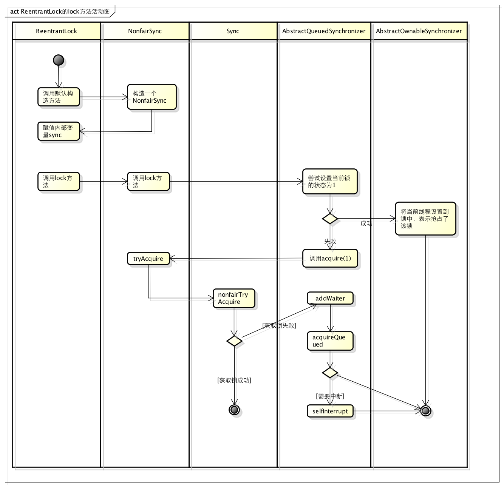

# 线程安全实现

## 多线程同步方案
1. sychronized
2. wait()和notify()
3. Lock
4. 无同步方案
    * 存在一些代码天生就是线程安全的，故不需要同步方案
    * 可重入代码：不依赖在堆上的数据和公用的系统资源、用到的状态量都是由参数传入。即一个方法是可预测的，输入了相同的数据，都能返回相同的结果，就满足可重入性
    * 线程本地存储：共享数据的所有代码在一个线程中执行，就可以把共享数据的看见范围限制在线程之内，“生产者-消费者”模式和web交互模型的“一个请求对应一个服务器线程”就是这类的应用

## 乐观锁和悲观锁
* 乐观锁：假设冲突不经常发生，先提交操作，如果失败就重试
* 悲观锁：假设会发生冲突，有强烈的独占和排他性

## 乐观锁应用
### 非阻塞同步
* 先进行操作，如果没有其他线程争用共享数据，那操作就成功了；如果存在争用，那么便产生了冲突，是一种乐观并发策略
* CAS操作
    * 比较并交换，Compare-and-Swap，可以通过一条处理器指令完成
    * java.util.concurrent.atomic包下的原子类型变量，如：AtomicInteger，使用了底层的JVM支持，为数字类型提供CAS操作
    * CAS操作会出现ABA问题，解决：不只更新引用值，而是更新引用+版本号，即使出现ABA，版本号也不同

## 悲观锁应用
### 互斥同步（Mutual Exclusion & Synchronization）
> 保证共享数据在同一时刻只能被一个线程使用，互斥是方法，同步是目的。临界区（Critical Section）、互斥量（Mutex）、信号量（Semaphore）都是实现互斥的手段
#### synchronized关键字
Java中互斥同步的手段就是synchronized关键字，经过编译后，会在同步块前后形成monitorenter和monitorexit两个字节码指令，当执行monitorenter时，首先要尝试获取对象锁，如果对象没有被锁定，或者当前对象已经拥有了锁，就把锁的计数器加1，如果执行到monitorexit时，计数器减1，当计数器为0时，锁就被释放；当获取对象锁失败，线程就要阻塞等待，直到对象锁被另一个线程释放
#### ReentrantLock重入锁
java.util.concurrent包中的重入锁ReentrantLock实现同步，机制类似，只是一个是API层面的互斥锁，一个是原生语法层面的互斥锁
http://www.cnblogs.com/zhengbin/p/6503412.html
* ReentrantLock实现
    
    ReentrantLock实现了Lock接口，内部有三个内部类，Sync、NonfairSync、FairSync，Sync是一个抽象类型，继承AbstractQueuedSynchronizer；AbstractQueuedSynchronizer是一个模板类，实现了许多和锁相关的功能，如tryAcquire，tryRelease等。Sync实现了AbstractQueuedSynchronizer的tryRelease方法。NonfairSync和FairSync两个类继承自Sync，实现了lock方法，然后分别公平抢占和非公平抢占针对tryAcquire有不同的实现。

* 流程图(非公平锁抢占)
    
    1. ReentrantLock的lock方法的时候，实际上调用NonfairSync的lock方法，该方法先用CAS操作尝试抢占该锁。如果成功，把当前线程设置在这个锁上，表示抢占成功。如果失败，调用acquire模板方法，等待抢占
    2. acquire方法内部使用tryAcquire这个钩子方法尝试再次获取锁
    3. tryAcquire一旦返回false，就会则进入acquireQueued流程，使用锁队列（本质：双向链表）实现，当前一个节点释放时，当前节点唤醒  
    **重入锁之所以可以重入，是同一个线程可以反复使用其占用的锁，相当于一个偏向锁**

* 补充：AbstractQueuedSynchronizer（**AQS**）
    * AQS使用一个int类型的volatile变量（命名为：state）维护同步状态
    * 实现锁的获取require()与释放release()
    * 排他模式（exclusive mode）和共享模式（shared mode）
    * require()至少调用一次tryAcquire()，同理release()

* 与synchronized区别
    * synchronized是原语层面的互斥锁，而ReentrantLock是API层面的互斥锁
    * 都可以线程重入（是同一个线程可以反复使用其占用的锁，相当于一个偏向锁）
    * 但ReentrantLock增加的3个功能
        1. 等待可中断：持有锁的线程长期不释放锁，等待锁的线程可放弃等待
        2. 可实现公平锁：公平锁指：多个线程等待同一个锁时，必须按照申请的顺序依次获得锁（默认是：非公平锁）
        3. 锁绑定多个条件：一个ReentrantLock对象可以同时绑定多个Condition对象（多次调用newCondition()方法），而synchronized只能一个
    * 关键：1）volatile修饰state，判断是否有加锁；2）AQS同步器实现锁的获取与释放；
    * TryAcquire()方法：如果锁state为0则尝试获取锁，否则：识别获取锁的线程是否为当前占据锁的线程，如果是再次成功获取
   
#### 信号量Semaphore
* 信号量是对锁的扩展，sychronized和重入锁ReentrantLock一次只允许一个线程访问一个资源，信号量可以指定多个线程同时访问一个资源
* 信号量可以用于做**流量控制**，控制最大并发量
* 信号量可以控制程序逻辑：singal(S), wait(S)
* 实现与ReentrantLock一样，依靠继承自AbstractQueuedSynchronizer的Sync实现主要功能，只是调用共享模式的：tryAcquireShared()方法

[返回目录](../CONTENTS.md)