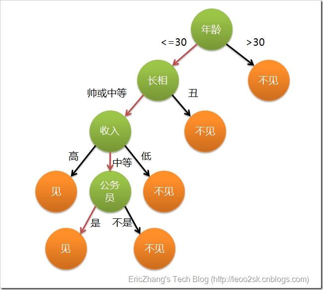
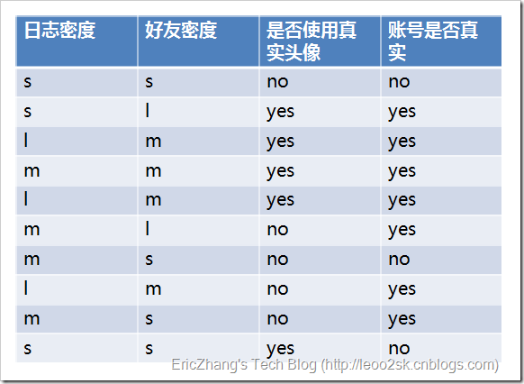
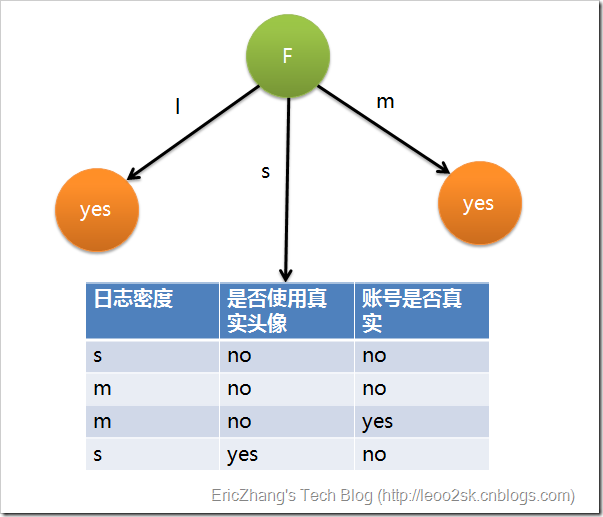

# 决策树

## 引言
**决策树（decision tree）** 是一个树结构。  
其每个非叶节点表示一个特征属性上的测试，每个分支代表这个特征属性在某个值域上的输出，而每个叶节点存放一个类别。  
使用决策树进行决策的过程就是从根节点开始，测试待分类项中相应的特征属性，并按照其值选择输出分支，直到到达叶子节点，将叶子节点存放的类别作为决策结果。  

## 决策树的构造
### 构造决策树
关键步骤是分裂属性，分裂属性分为三种不同的情况：
* 属性是离散值且不要求生成二叉决策树。此时用属性的每一个划分作为一个分支
* 属性是离散值且要求生成二叉决策树。此时使用属性划分的一个子集进行测试，按照“属于此子集”和“不属于此子集”分成两个分支
* 属性是连续值。此时确定一个值作为分裂点split\_point，按照$>split\_point$和$\leq{split\_point}$生成两个分支

### ID3算法:

设D为用类别对训练元组进行的划分，则D的熵（entropy）表示为：

$$info(D)=-\sum_{i=1}^{m}{p_i\log_2(p_i)}$$

$p_i$表示第i个类别在整个训练元组中出现的概率

假设将训练元组D按属性A进行划分，则A对D划分的期望信息为：

$$info_A(D)=\sum_{j=1}^{v}{\frac{D_j}{D}info(D_j)}$$

而信息增益即为两者的差值：

$$gain(A)=info(D)-info_A(D)$$

使用增益率最大的属性值作为当前的节点进行分裂，最后即可构造决策树。  

下面使用SNS社区中不真实账号检测的例子说明如何使用ID3算法构造决策树。为了简单起见，我们假设训练集合包含10个元素：

设L、F、H和R表示日志密度、好友密度、是否使用真实头像和账号是否真实，下面计算各属性的信息增益。

$$info(D)=-0.7\log_2(0.7)-0.3\log_2(0.3)=0.879$$

$$info_L(D)=0.3*(-\frac{0}{3}\log_2(\frac{0}{3})-\frac{3}{3}\log_2(\frac{3}{3}))+0.4*(-\frac{1}{4}\log_2(\frac{1}{4})-\frac{3}{4}\log_2(\frac{3}{4}))+0.3*(-\frac{1}{3}\log_2(\frac{1}{3})-\frac{2}{3}\log_2(\frac{2}{3}))=0.603$$

$$gain(L)=0.879-0.603=0.276$$

因此日志密度的信息增益是0.276。用同样方法得到H和F的信息增益分别为0.033和0.553。

因为F具有最大的信息增益，所以第一次分裂选择F为分裂属性，分裂后的结果如下图表示：

在上图的基础上，再递归使用这个方法计算子节点的分裂属性，最终就可以得到整个决策树。

### C4.5算法

如果存在唯一标识属性ID，则ID3会选择它作为分裂属性，这样虽然使得划分充分纯净，但这种划分对分类几乎毫无用处。

C4.5算法首先定义了“分裂信息”，其定义可以表示成：

$$split\_info_A(D)=-\sum_{j=1}^{v}{\frac{D_j}{D}\log_2(\frac{\vert{D_j}\vert}{\vert{D}\vert})}$$

增益率被定义为：

$$gain\_ratio(A)=\frac{gain(A)}{split\_info(A)}$$

[返回目录](../CONTENTS.md)