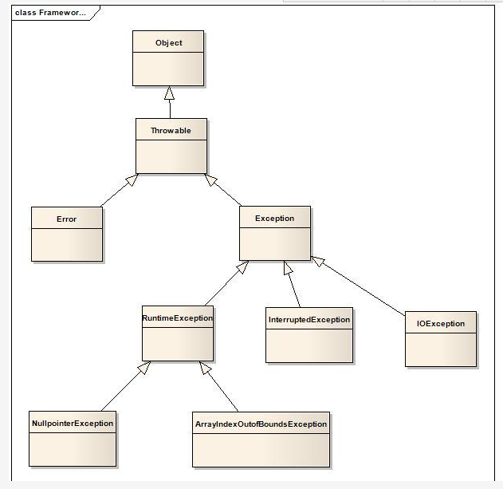

# 爱奇艺
1. 矩阵相乘
```
double[][] c=new double[a.length][b[0].length];
for(int i=0;i<a.length;i++) {
      for(int j=0;j<b[0].length;j++) {
           for(int k=0;k<a[0].length;k++) {            
               c[i][j] += a[i][k] * b[k][j]; 
            }
      }
}
```

## 现场面试
1. RuntimeException和Exception的区别
* RuntimeException必须写catch块处理，否则会导致程序中断

2. MySQL如何保证事务的ACID
* 隔离级别
    * MySQL的InnoDB中，预设的事务隔离级别为：Repeatable Read可重复读
* 加锁（MySQL锁机制）
    * MySQL的InnoDB中，INSERT、UPDATE、DELETE会自动给涉及的数据加排他锁，SELECT一般不加锁
    * 但是，SELECT可以通过以下两种方式显示加锁：
        * 共享锁：SELECT ... LOCK IN SHARE MODE
        * 排他锁：SELECT ... FOR UPDATE
    * MySQL有Row-Level Lock行级锁和Table Lock表级锁，InnoDB预设是Row-Level Lock
    * 注：MySQL锁根据类型可分为共享锁和排他锁，根据粒度可分为行级锁和表级锁
* MySQL的多版本并发控制技术（MVCC）--解决幻读，和行级锁关联使用
3. MongoDB如何保证CAP
   * 要保证C：最终一致
   * 要保证A：节点在响应请求时，不完全考虑整个集群的数据是否一致
   * P：集群中的某些节点在无法联系后，集群整体是否还能继续工作
   * 另：MongoDB的隔离级别为：读已提交
4. synchronize加在普通方法和static方法上的区别
```
synchronized void method1() {
}
//相当于
void method1() {
    synchronized(this) {
    }
}
/*******************************************/
static synchronized method2() {
}
//相当于
static method2() {
    synchronized(this.getClass()) {
    }
}
```
* 非静态synchronized方法相当于使用对象的this作为锁，因此不能在同一个对象内同时调用两个非静态synchronized方法
* 静态synchronized方法相当于使用对应类作为锁
5. Spring MVC和Spring-boot的区别
* Spring两大特性：IoC和AOP
* 为开发web应用，整合MVC框架，产生SpringMVC
* 为简化工作流程，开发自动配置的Spring Boot
6. 单例模式的多线程处理
* 普通单例
```
public class Singleton{        
    private static Singleton instance;        
    private Singleton(){              
    }        
    public static Singleton getInstance(){    
        if (instance == null)        
            instance = new Singleton();  
        return instance;         
    }        
}   
```
* 多线程下处理单例
```
public class Singleton{        
    private Singleton(){             
    }        
    private static class SingletonContainer{
        private static Singleton instance = new Singleton();        
    }        
    public static Singleton getInstance(){
        return SingletonContainer.instance;
    }        
}   
```
7. java类初始化只初始化一次吗
* 是的
* 初始化过程的主要操作是执行静态代码块和初始化静态域
* 为了防止多次执行clinit，虚拟机会确保clinit方法在多线程环境下被正确的加锁同步执行，如果有多个线程同时初始化一个类，则只有一个线程能够执行clinit方法，其它线程进行阻塞等待，直到clinit执行完成
* 双亲委派模型
8. HTTP和HTTPS的区别
* HTTPS：是HTTP的安全版，HTTP下加入SSL(Secure Sockets Layer 安全套接层)，加密
9. Restful机制
* 架构核心规范与约束：统一接口
* GET、POST、PUT、DELET
10. VUE和AngularJS
* 都是双向绑定，但VUE更简洁
11. 装饰者模式应用
* Java IO流
```
BufferedReader in = new BufferedReader( new InputStreamReader ( System.in ) );
BufferedReader in = new BufferedReader( new FileReader ( fileName ) );
```
12. 十进制转二进制
```
思路1：
输入一个十进制数n，每次用n除以2，把余数记下来，再用商去除以2...依次循环，直到商为0结束，把余数倒着依次排列，就构成了转换后的二进制数。
public int binaryToDecimal1(int n) {
    int t = 0;  //用来记录位数
    int bin = 0; //用来记录最后的二进制数
    int r;  //用来存储余数
    while (n != 0) {
        r = n % 2;
        n = n / 2;
        bin += r * (int) Math.pow(10, t);
        t++;
    }
    return bin;
}
或者
public String binaryToDecimal2(int n) {
    String str = "";
    while (n != 0) {
        str = n % 2 + str;
        n = n / 2;
    }
    return str;
}
思路2：
移位操作(结果中会有多余的0)
public void binaryToDecimal3(int n) {
    for (int i = 31; i >= 0; i--)
        System.out.print(n >>> i & 1);
}
思路3：
调用API
public void binaryToDecimal4(int n) {
    String result = Integer.toBinaryString(n);
    System.out.println(result);
}
```
13. java反射机制
14. MySQL和MongoDB的区别
15. 轻量级锁、重量级锁和偏向锁
16. java类加载过程

## 终面
1. HDFS原理：[HDFS知识点总结](https://www.cnblogs.com/caiyisen/p/7395843.html)
* HDFS数据块：HDFS上的文件被划分为数据块，作为独立的存储单元，默认大小是64MB。
* HDFS的三个节点：Namenode，Datanode，Secondary Namenode
    * Namenode：HDFS的守护进程，用来记录文件是如何分割成数据块，以及数据块分别被存储到那些数据节点上
    * Datanode：文件系统的工作节点，定期向namenode发送他们所存储的块的列表
    * Secondary Namenode：辅助后台程序，与NameNode进行通信，以便定期保存HDFS元数据的快照
2. zookeeper选主流程采用什么协议，具体与paxos协议有什么不同：[Zookeeper与Paxos](https://www.cnblogs.com/leesf456/p/6012777.html)
* Zookeeper使用了Zookeeper Atomic Broadcast（ZAB，Zookeeper原子消息广播协议）协议作为其数据一致性的核心算法
* Zookeeper引入了Leader、Follower、Observer三种角色，Leader服务器为客户端提供写服务，Follower和Observer提供读服务
* 与Paxos区别
    * Paxos算法中，新选举产生的主进程会进行两个阶段的工作，第一阶段称为读阶段，新的主进程和其他进程通信来收集主进程提出的提议，并将它们提交。第二阶段称为写阶段，当前主进程开始提出自己的提议。
    * ZAB协议在Paxos基础上添加了同步阶段，此时，新的Leader会确保存在过半的Follower已经提交了之前的Leader周期中的所有事务Proposal。
3. JVM参数
* -Xms：-XX:InitialHeapSize的简写 表示初始化堆的大小
* -Xmx：-XX:MaxHeapSize的简写 表示设置堆的最大大小
4. 虚拟内存
* 一种内存管理技术，使程序自己认为自己拥有一块很大且连续的内存，然而，这个程序在内存中不是连续的，并且有些还会在磁盘上，在需要时进行数据交换 
* 在内存管理时，页是地址空间的最小单位
* 对于进程来说，使用的都是虚拟地址，每个进程维护一个单独的页表
5. JVM垃圾回收器CMS
* CMS全称 Concurrent Mark Sweep，是一款并发的、使用标记-清除算法的垃圾回收器
6. 算法
```
Part1：树的层次遍历
public void levelOrder(TreeNode root, StringBuilder sb) {
    Queue<TreeNode> queue = new ArrayDeque<>();
    //队列小知识：使用offer和poll优于add和remove之处在于它们返回值可以判断成功与否，而不抛出异常

    queue.offer(root);
    while (!queue.isEmpty()) {
        TreeNode t = queue.poll();
        sb.append(t.data).append(" ");
        if (t.left != null) {
            queue.offer(t.left);
        }
        if (t.right != null) {
            queue.offer(t.right);
        }
    }
}
Part2：树的之字形遍历
* 使用两个辅助栈来分别存储奇数层节点和偶数层节点
* 奇数层，从右往左插入，先添加右子树，再添加左子树
* 偶数层，从左往右插入，先添加左子树，再添加右子树
public void rotateOrder(TreeNode root, StringBuilder sb) {
    int level = 1;
    //s1存奇数层节点
    Stack<TreeNode> s1 = new Stack<>();
    s1.push(root);
    //s2存偶数层节点
    Stack<TreeNode> s2 = new Stack<>();

    while (!s1.empty() || !s2.empty()) {

        if (level % 2 != 0) {
            while (!s1.empty()) {
                TreeNode node = s1.pop();
                if (node != null) {
                    sb.append(node.data).append(" ");
                    s2.push(node.right);
                    s2.push(node.left);
                }
            }
        } else {
            while (!s2.empty()) {
                TreeNode node = s2.pop();
                if (node != null) {
                    sb.append(node.data).append(" ");
                    s1.push(node.left);
                    s1.push(node.right);
                }
            }
        }
        level++;
    }
}
```

[返回目录](../../CONTENTS.md)