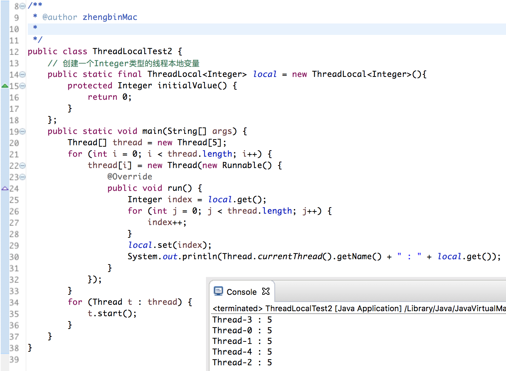

# 京东
## 笔试
1. ArrayList和LinkedList都实现了List接口
2. @Transactional，Spring-boot中的事务
3. Java堆通过Xmx和Xms指定最大内存和最小内存
4. Linux的sed：是一种流编辑器
5. **java.lang.ThreadLocal**
* ThreadLocal为每个使用该变量的线程提供独立的变量副本，每个线程独立地改变自己的副本，而不影响其他线程的副本
* 通常ThreadLocal实例使用private static修饰，将状态与线程相关联
* ThreadLocal中有一个内部类ThreadLocalMap，存值：<ThreadLocal对象，存放的值>，优点：每一个线程对应一个ThreadLocalMap，一个线程可以有多个线程本地变量

* 不是用来解决共享变量或者线程同步的
* [参考链接](http://www.cnblogs.com/zhengbin/p/5674638.html)
* 使用


## 现场面试
1. 轻量级锁怎么申请
* 利用对象的头信息中的“Mark Word”部分，使用CAS操作尝试将其更新为指向栈中锁记录的指针。
* 如成功说明已经拥有锁，标志位转为“00”
* 如果失败，首先检查“Mark Word”是否指向当前栈帧，如果是，直接进入同步块，否则说明锁对象已经被其他线程抢占，膨胀为重量级锁，标志位变成“10”
2. 线程计数的count能用volatile吗
* 不能，理由：
    * volatile仅保证从主内存加载到工作内存的值是最新的，但加载操作不是原子的
* 因此，线程计数器要用compareAndSet保证原子性
3. 线程池构造器中的参数
* corePoolSize：核心线程池的大小，默认情况下，线程池中的线程数为0，当有任务来之后，就会创建一个线程去执行任务，当线程池中的线程数目达到corePoolSize后，就会把到达的任务放到缓存队列当中；
* maximumPoolSize：线程池最大线程数
* keepAliveTime：表示线程没有任务执行时最多保持多久时间会终止。默认情况下，只有当线程池中的线程数大于corePoolSize时，keepAliveTime才会起作用，直到线程池中的线程数不大于corePoolSize
* unit：参数keepAliveTime的时间单位
* workQueue：阻塞队列，用来存储等待执行的任务
4. 数据库中的乐观锁与悲观锁
* 悲观锁，认为冲突总是发生，独占和排他性，在整个数据处理过程中，将数据处于锁定状态
* 乐观锁：大多基于版本标识（version）实现，读数据时将版本号一起读出，更新数据时，版本号+1
5. sleep和wait的区别
* sleep()是Thread类的方法，而wait()是Object类的方法
* 调用sleep()，线程不会释放对象锁
* 调用wait()，线程放弃对象锁，只有调用notify()后，才唤醒
6. 一致性hash
* 常用于负载均衡
* 步骤：
    * 首先求出memcached服务器（节点）的哈希值，并将其配置到0～2^32的圆上
    * 然后采用同样的方法求出存储数据的键的哈希值，并映射到相同的圆上
    * 然后从数据映射到的位置开始顺时针查找，将数据保存到找到的第一个服务器上。如果超过2^32仍然找不到服务器，就会保存到第一台memcached服务器上
* 优点：
    * 容错性和可扩展性
        * 某节点不幸宕机，只影响本节点和前一节点的数据
        * 增加某节点，也只影响本节点和前一节点的数据
7. 重入锁的等待中断机制
* 持有锁的线程长期不释放锁，等待锁的线程可放弃等待
```
ReentrantLock lock = new ReentrantLock();
lock.lockInterruptibly(); // 可以响应中断
// 产生中断部分：
产生InterruptedException异常
```
8. SQL执行计划
* explain关键字
```
explain SELECT * FROM instructor;
```
* 显示的结果

    * id相同：执行顺序由上至下；id不同：如果是子查询，id的序号会递增，id值越大优先级越高，越先被执行；
    * ref：若是常数等值查询，会显示const；若是连接查询，会显示关联字段
    * rows：执行计划中估算的扫描行数
9. Collection和Collections区别
* Collection是集合接口，提供集合的基本操作：add、remove、equals、size
* Collections是集合类型的工具类，提供一系列静态方法，如：sort、binarySearch、线程安全操作
10. java1.8新特性

[返回目录](../../CONTENTS.md)