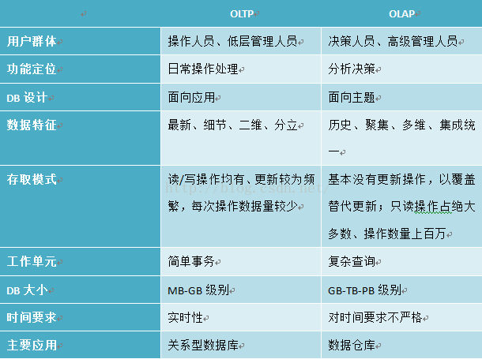
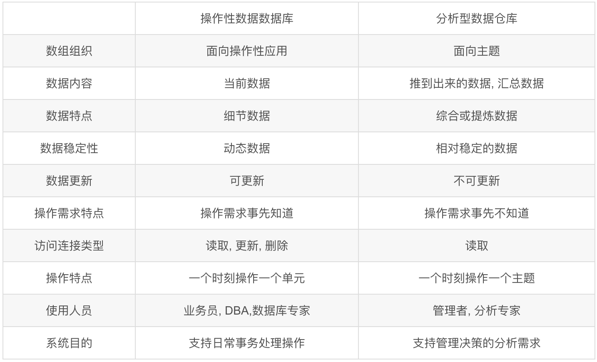
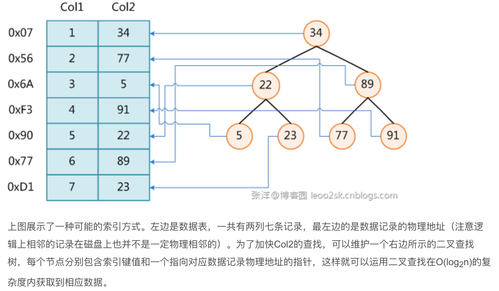

# 招商银行信用卡
## 现场面试
1. 测试中的覆盖
* 结构化覆盖
    * 顶点覆盖
    * 边覆盖
* 主路径覆盖
    * 主路径：长度极大化的简单路径
* 逻辑测试
    * 语句覆盖（把所有判断语句都执行一次）
    * 判定覆盖（把Decision判定的True和False各执行一次）
    * 条件覆盖（把每一个条件的True和False各执行一次）
        * A XOR B, (A=T,B=T) (A=F,B=F), 满足条件覆盖但不满足判定覆盖

## 大数据方向
1. 数据仓库中的拉链表
* 数据仓库经常用历史数据和时间维度做数据分析
* 所谓拉链，就是记录历史，记录某一事物从开始到当前状态的所有变化信息
* 在SQL记录中增加开始时间和结束时间
2. 读文件的300~500行Linux命令
```
cat file | head -n 500 | tail -n +300
sed -n ‘300,500p’ file
```
3. SQL：读各个部门工资最高的人
```
SELECT dep.Name as Department, emp.Name as Employee, emp.Salary 
FROM Department dep, Employee emp 
WHERE emp.DepartmentId=dep.Id 
and emp.Salary=(SELECT max(Salary) FROM Employee e2 WHERE e2.DepartmentId=dep.Id);
```
4. 数据仓库ETL的探索阶段做什么
```
数据仓库中对源数据分析主要有两个阶段：一是数据探索阶段，二是异常数据监测阶段
数据探索阶段包括：
* 收集所有源系统的文档、数据字典等；
* 收集源系统的使用情况；
* 判断数据的起始来源；
* 通过数据概况对原系统的数据关系进行分析
数据探索阶段的主要目的是：理解源系统的情况，为后续的数据建模和逻辑数据映射做准备
```
5. hadoop备份系数dfs.replication
备份系数在hdfs-site.xml中定义，默认值为3.
```
<property>
    <name>dfs.replication</name>
    <value>3</value>
</property>
```

## 面试
1. HTTP和socket的区别
* HTTP1.0默认使用短连接，HTTP1.11起默认使用长连接；Socket为长连接，通常情况下，Socket连接就是TCP连接（狭义）
* Socket连接可以由服务器直接向客户端发送数据；HTTP连接服务器需要等客户端发送请求后将数据传送给客户端
* 实际上，Socket可以支持不同的传输层协议（TCP或UDP）
2. HTTPS握手保证安全

```
1. 客户端发起HTTPS请求
2. 服务端配置
3. 传送证书
4. 客户端解析证书
5. 传送加密信息
6. 服务端解密信息
7. 传输加密后的信息
8. 客户端解密信息
```
3. zookeeper的CAP
* 假设zookeeper有2n+1个server，同步过程中，leader向follower同步数据，当同步完成的数量大于n+1时，同步流程结束
* C：zookeeper保证了最终一致性
* A：zookeeper保证了可用性
* P：分区容错
* zookeeper的三个角色：Leader，Follower，Observer
    * Leader：整个集群的主节点，响应所有对zk状态变更的请求
    * Follower：响应本服务器上的读请求 & 处理Leader的提议
    * Observer：不参加选举，不响应提议，目的：提高读取的吞吐量
4. OLTP和OLAP比较
* OLTP：联机事务处理，OLAP联机分析处理

5. 操作型数据库和分析型数据库的区别
* 与OLTP和OLAP类似
* 数据仓库是面向分析处理组织，数据库是面向事务处理组织

6. 分布式数据库的分片
* 数据存储单位为片段，将片段分配到不同服务器上
* 分片原则
```
1. 完备性：所有全局数据都要映射到某个片段上
2. 可重构性：所有片段可以重构成全局数据
3. 不相交性：划分片段的数据无交集
```
7. 索引原理
* 非聚集索引和聚集索引：聚集索引可以查到需要查找的数据，非聚集索引可以查到记录对应的主键值，再将主键值通过聚集索引查到需要的数据
* 索引通常实现使用B树或者B+树
* 索引有代价：1）增加了数据库的存储空间；2）插入和修改数据时，索引也要更新

8. 数据仓库的四个特点
* 面向主题的
* 集成的
* 相对稳定的
* 反映历史变化的

[返回目录](../../CONTENTS.md)