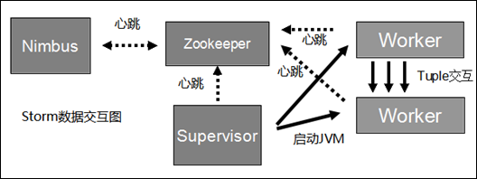

# 分布式
## Apache flume
* GitHub地址：[/apache/flume](https://github.com/apache/flume)
* Flume是Cloudera提供的高可用、高可靠、分布式的海量日志采集、聚合和传输的系统
* Flume可以对数据进行简单处理，并存储到各种集中存储器中，如：HDFS、HBase
* 基本组件架构

    * flume agent：由若干source, channel, sink组成，source接收来自外源（external source）发送来得数据，并将数据写入一个或多个channel中，channel被动存储接收的数据直至数据被sink消费，存储到集中存储器中
    * event：数据流的基本单位
    * 可靠性：channel提供事务性，保证数据在收发时的一致性，以此保证数据分发的可靠性
* 多路分发
    * flume支持多路分发，支持一个源发布到多个端

    * 一个source实例可以配置多个channel，但一个sink只能配置指定到一个channel
    * 多路分发有两种实现方式：1）复制（replicating）；2）多路技术（multiplexing）；
* flume轮询机制
    * flume agent会不断查看配置文件是否修改更新，若更新则重新加载

## Hadoop
* 生态系统包括：
    * HDFS，分布式的、不可更新的（hdfs文件只能写一次，一旦关闭不再修改）
    * MapReduce框架，分布式计算框架
    * YARN，Hadoop集群中默认的资源管理器，参考论文
    * Hive，构建在MapReduce框架上的类sql查询引擎
    * Hbase，基于HDFS的键值对存储系统

## Spark
* 主要包含
    * Spark Core，通用分布式数据处理的引擎
    * Spark SQL，Spark上的SQL查询语句，支持一系列的SQL函数和HiveQL
    * Spark Streaming，基于Spark的微批处理引擎
    * MLlib，构建在Spark上的机器学习库，支持一系列数据挖掘算法
* Shuffle过程
    * 定义：整个数据传输过程
    * Shuffle写过程：一个分区的数据计算完毕并写入磁盘的过程
    * Shuffle读过程：在子RDD分区计算过程中，把所需数据从父RDD拉取过来的过程
* 容错：血缘机制（Lineage）
* 宽依赖和窄依赖
    * 窄依赖：父RDD的每个分区可以被至多一个子RDD分区使用
    * 宽依赖：父RDD的每个分区可以被多个子RDD分区使用
* Transformation和Action（转换和动作）
    * Transformation是延迟操作，如：Map、Filter
    * Action启动计算操作，如：Reduce

## Storm
* 分布式高容错的实时计算系统
* 数据交互图

* Nimbus，在集群中发送代码，分配给工作机器，并监控状态；全局仅一个
* Supervisor，每一个要运行Storm的机器上均要部署一个，负责监听相应机器的工作
* Zookeeper，是Storm重点依赖的外部资源，且ZooKeeper是以Paxos算法为基础的
    * Paxos算法三个角色：proposer提出者，acceptor批准者，learner接收者
* Topology，是Storm提交运行的程序，由Spout和Bolt构成
* Tuple，是Topology处理的最小消息单位

## Docker
* Virtual Machine与Docker
    * Virtual Machine
    
    * Docker
    
* 到：[Docker Practice](https://yeasy.gitbooks.io/docker_practice/content/introduction/what.html)

[返回目录](../CONTENTS.md)