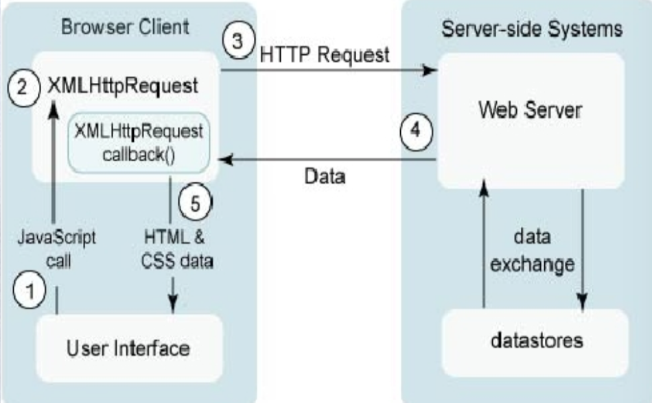

# Web开发技术
## CSS
* Cascading Style Sheet，层叠样式表
* 实现网页的呈现与内容分离
* CSS盒模型：内容、内边距（padding）、边界、外边距（margin）
* 响应式网页设计
    * 理念：智能地根据用户行为和设备环境（系统平台、屏幕尺寸、屏幕定向等）进行相对布局
    * 方法
        * Fluid Grid（流体表格）--采用百分比，长度绝对变相对
        * Liquid Image（流体图像）--图像相对位置
        * CSS3 media queries（CSS3媒体查询器）--针对不同媒体类型定义不同样式@media

## HTML5
* 大小写不敏感
* 结构

* 定义字符集 `<meta charset=”utf-8”>`
* 表单


## JavaScript
* 大小写敏感
* 注释
    * HTML `<!-- -->`
    * CSS/JS/PHP `/*  */`
    * Java/JS/PHP `//`
    * PHP `#`
* Array操作


## DOM
* Document Object Model，文档对象模型
* DOM节点类型：元素节点，文本节点，属性节点
* DOM树：`(HTML(HEAD(TITLE),BODY(H1,DIV(P))))`
* DOM0事件处理程序，将一个函数赋值给一个事件程序属性
* DOM2事件流三阶段
    * 捕获阶段，根节点->目标节点
    * 目标节点阶段，同DOM0
    * 冒泡阶段，目标节点->根节点，反向回溯

## CGI
* Common Gateway Interface通用网关接口
* 是CGI程序与Web服务器之间的接口标准

## 网站性能优化思路

* Yslow技术
    1. CSS优化：将CSS放于HTML顶部，减小文件大小
    2. Image优化：尽量呈现图像原始大小；整合多张图片，减少网站的HTTP请求（技术：CSS Sprite，即CSS精灵）
    3. js优化：最小化js
    4. 服务器优化：压缩算法
* Bigpipe技术
    * 原理：采用小页面pagelet，加快网页显示
    * 优点：响应快，可并发，减少HTTP请求
    * 缺点：强制页面模块化，部分运算转移到浏览器，需要考虑到浏览器的兼容问题

## Memcached


## Ajax
* Asynchronous Javascript and XML
* 原理：异步，页面局部更新，响应更快
* 优点：
    1. 异步，交互性更强，更友好
    2. 局部刷新页面，响应快
* 缺点：
    1. 存在书签化问题
    2. 破坏前进后退按钮的正常行为
    3. 存在安全隐患
    4. 与搜索引擎相关
    5. Ajax无刷新重载，导致页面变化不明显
* 案例：
```
jQuery.ajax({
    url : 'updateOrderPro',
    processData : true,
    dataType : "text",
    data : {
        id : id,
        date : date
    },
    success : function(data) {
        console.log(id);
    }
});
```
* Ajax请求过程

    * 注：第2步是：创建XMLHttpRequest对象