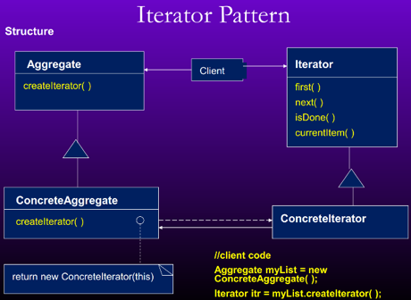
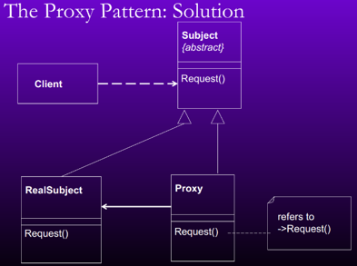
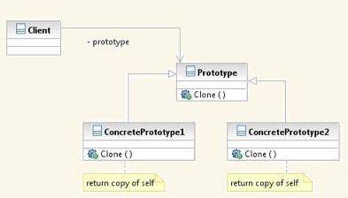
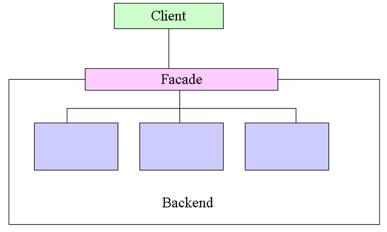
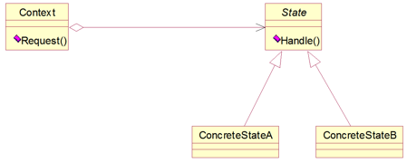
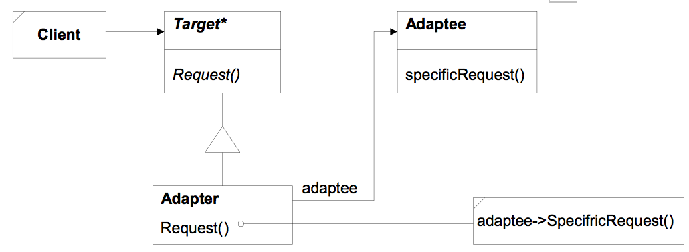
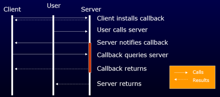
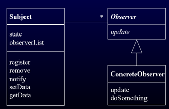

# 设计模式
- [Git代码: SeniYuting/DesignPattern](https://github.com/SeniYuting/DesignPattern)
## 迭代器模式
* Iterator Pattern，有代码
* 目的：隐藏集合类型的底层结构，使得不同的集合类型，对外呈现统一的接口

* 左：ConcreteAggregate 是聚合对象，存在数据和方法；
* 右：ConcreteIterator 是迭代器，无数据；

## 代理模式
* Proxy Pattern

* Client不能直接访问RealSubject，而访问Proxy，并且会形成访问RealSubject的错觉；
* Proxy和RealSubject对外接口一样；

## 原型模式
* Prototype 数据访问控制，有代码

* 解决：类的创建问题，现方法：依赖注入；
* 方案：采用一个原型对象，clone( )，不采用引用传递，而是在clone( )里值传递；

## 装饰者模式
* Decorator Pattern，有代码

* 比单独的继承灵活，但又保留了继承接口的灵活性

## Facade模式
* 即：原controller

* 优点：给模块或子系统提供整体的接口（统一代替分散）；定义高层接口，调用方便；

## 策略模式
* Strategy Pattern，有代码

* 解决问题：模块内部变化，与需求无关，要求改变不影响模块其他部分；
* Context：原有对象，整体，承担更多需求；
* Strategy：抽象类，差异，变更的行为，承担很少需求；

## 状态模式
* State Pattern
* 本质即：策略模式

* 对象的行为依赖于状态，状态不同，行为不同

## 桥接模式
* Bridge Pattern，有代码
* 在策略基础上，封装了接口变化；解耦接口与实现；增强了可扩展性；Client调用接口，接口调用实现，隐藏实现；

* 例：Shape

* 左下若删除则为策略模式
* 聚合：表示绑定，左边为接口部分，右边为实现部分，绑定表示特定类型，如：DP1；
* 增加类型，左边；增加画法，右边；

## Adapter模式

* Adapter委托到Adaptee，将接口变为Client想要的，解耦，很好地应对变化；
* 对外交互，应该考虑Adapter；

## Mediator模式

* 本质：connector
* 解决的问题：很多对象，相互独立平等，产生有规则的互动，规则即：Mediator；

## 观察者模式
* Observer，有代码
* 运行时注册

* 服务器端维护一个Dictionary
    1. 客户端在服务器端注册，服务器端Dictionary产生一条记录；
    2. 另一用户发生触发事件；
    3. 服务器端查记录，通知客户端；
    4. 客户端回调
* 观察者模式

* 使用场景：客户端调服务器，但不知什么时候调；服务器知道什么时候调，但又不知客户端；

## 命令模式
* Command Pattern，有代码
* 如：undo、redo